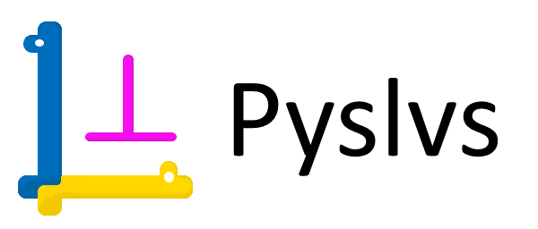
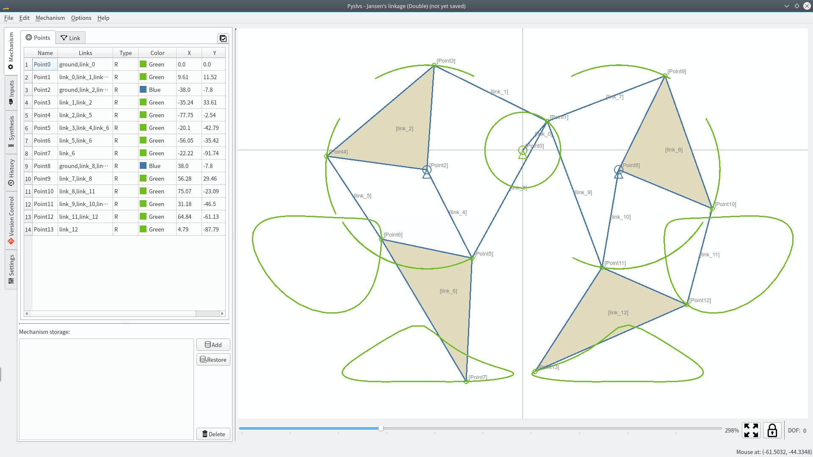
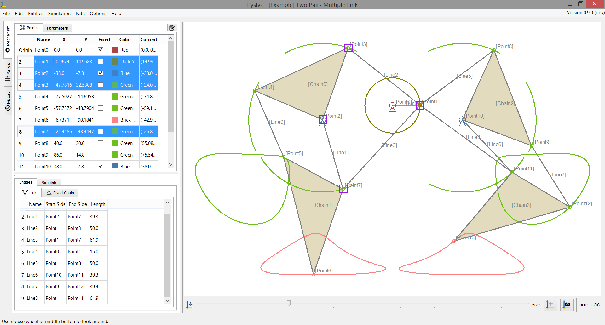
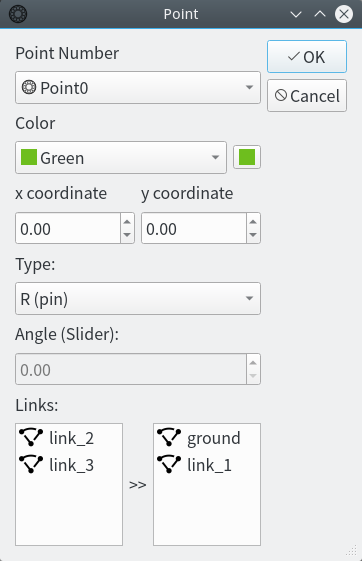
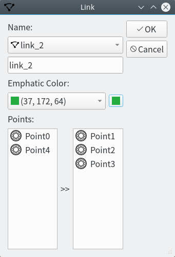

[](https://github.com/KmolYuan/Pyslvs-PyQt5/releases)
[](https://travis-ci.org/KmolYuan/Pyslvs-PyQt5)
[](https://www.python.org/)
[](https://riverbankcomputing.com/software/pyqt/intro)
[](https://github.com/KmolYuan/Pyslvs-PyQt5/releases)
[](https://github.com/KmolYuan/Pyslvs-PyQt5/releases)
[](https://raw.githubusercontent.com/KmolYuan/Pyslvs-PyQt5/master/LICENSE)

[](http://pyslvs.com "Click here go to our website.")

1. [Introduction](#introduction)

    + [How to startup](#how-to-startup)
    + [Symbolic](#symbolic)
    + [Algorithm](#algorithm)

1. [Modules Requirement](#modules-requirement)

    + [Graphviz](#graphviz)
    + [PyQt Stuff](#pyqt-stuff)

1. [Kernels Requirement](#kernels-requirement)

    + [Python-solvespace Kernel](#python-solvespace-kernel)
    + [Dimensional Synthesis Kernel](#dimensional-synthesis-kernel)

1. [Stand-alone Executable File](#stand-alone-executable-file)

1. [Power By](#power-by)

# Introduction

A GUI-based tool solving 2D linkage subject.

+ **Planar Linkages Simulation**: Kernel from [Solvespace] with Python bundle (SWIG).

+ **Dimensional Synthesis**: Kernel from three Cython algorithm API (rewrite).

Compatible with Python 3.5, PyQt 5.7 (for PyQtChart) and above.

Cross-platform Development: Ubuntu and Windows (64-bit).

You should install Graphviz first. See [here](#graphviz).

**Please note that the other platforms may be available but I have not tested before.**

Previews in KDE Plasma desktop:



Previews in Windows 8.1 theme:



## How to startup

Open GUI by Python:

```bash
python3 launch_pyslvs.py
```

Or see help:

```bash
python3 launch_pyslvs.py --help
```

## Symbolic

Referring symbolic from [PMKS](http://designengrlab.github.io/PMKS/).

1. Point

    

1. Link

    

## Algorithm


Contains three algorithms:

+ Real Genetic Algorithm
+ Firefly Algorithm
+ Differential Evolution

Specify a path and options to generate a crank rocker.

This function has a simple TCP ZMQ connecting mode.

# Modules Requirement

You should install some python module and SDK first.

The Makefile is included at compile steps, so some environment setting also should be set.

**Ubuntu**:

```bash
$ sudo pip3 install -r requirements.txt
```

**Windows**:

Python 3: [Official Python] for Windows 64 bit.

Makefile tool: [MinGW] for win64.

```bash
> pip install -r requirements.txt
```

## Graphviz

Graphviz tools provide some graph engine that can make the position of dots in atlas looks more pretty.

Download it from [here](https://www.graphviz.org/) or:

```bash
$ sudo apt install graphviz
```

Windows user please make sure to add Graphviz `bin` folder path to environment variables.

Then use the `dot` command to check if it works.

## PyQt Stuff

PyQt5 and QtChart are now pack into the wheel file that Windows and Ubuntu can use them.

When the installation is complete by pip, some stuff need to remind you.

Qt tools can use to design the user interface, they are not the requirement if you just want to run Pyslvs.

**Ubuntu**:

Download [Qt5] and install it, then we will get the tools.

If your desktop is made by earlier Qt version, you should install in another place.

Download and install / upgrade [SIP].

```python
>>> import sip
>>> print(sip, sip.SIP_VERSION_STR)
```

Then remove SIP from the location:

```bash
$ sudo rm -fr /usr/local/lib/python3.5/dist-packages/sip*
```

Or maybe directly:

```bash
$ sudo pip3 install sip -U
```

**Windows**:

Windows user can get Qt tools by pip, and don't need to install Qt package.

```bash
> pip install pyqt5-tools
```

# Kernels Requirement

Make command:

```bash
make build-kernel
```

This project including 2 kernels should build, please following the steps if you are first time to use.

## Python-solvespace Kernel

Make command:

```bash
make -C core/kernel/python_solvespace
```

**Ubuntu**:

First, install SWIG. This tool kit can make a Python bundle with C/C++ library.

If your not, install python development kit.

```bash
sudo apt install swig python3-dev
```

**Windows**:

Download and install [SWIG](http://www.swig.org/download.html).

If your Python doesn't have development library, like `libpython35.a`, using `gendef` to generate it.

**In Python 3.6 and above versions, you do not have to get lib file.**

First copy `python3x.dll` to `where_your_python\libs` folder.

Then using this command:

```bash
gendef python3x.dll
dlltool --dllname python3x.dll --def python3x.def --output-lib libpython3x.a
```

You need to modify a few of Python files to avoid these conflicts before compile the library. But you can be assured that the changes won't cause any negative impact.

Find this code in `where_your_python\Lib\distutils\cygwinccompiler.py`:

```python
# no additional libraries needed
self.dll_libraries=[]

# Include the appropriate MSVC runtime library if Python was built
# with MSVC 7.0 or later.
self.dll_libraries = get_msvcr()
```

Commit `self.dll_libraries = get_msvcr()`.

And then adjust source code about Virtual Studio. Find this code in `where_your_python\include\pyconfig.h`.

```c
#ifdef _WIN64
#define MS_WIN64
#endif
```

Cut them and paste **Above** this:

```c
#ifdef _MSC_VER
```

You also will get warning with `_hypot` in `pyconfig.h`, and you should do this step.

In `where_your_python\include\pyconfig.h`, find this:

```c
#define COMPILER "[gcc]"
#define hypot _hypot
```

Edit it to this:

```c
#define COMPILER "[gcc]"
#ifndef _MATH_H_
#define hypot _hypot
#endif
```

## Dimensional Synthesis Kernel

Make command:

```bash
make -C core/kernel/pyslvs_algorithm
```

**Ubuntu**:

Ubuntu user can compile the kernel by Cython directly.

**Windows**:

If you are using 64 bit OS with 64bit Python, unfortunately you **can not** use mingw64 to complete the compilation.

Using Microsoft Visual Studio is the only option, you can get it from [here][visualstudio-link], then startup the Visual Studio Community and install Windows SDK.

When installation finished, see the instructions [here][cython-link] to set up the Windows SDK.

[visualstudio-link]: https://www.visualstudio.com/downloads/
[cython-link]: https://github.com/cython/cython/wiki/CythonExtensionsOnWindows#using-windows-sdk-cc-compiler-works-for-all-python-versions

# Stand-alone Executable File

As your wish, it can be renamed or moved out and operate independently in no-Python environment.

**Ubuntu**:

Use shell command to build as [AppImage](https://github.com/AppImage/AppImages).

After following operation, the executable file is in `out` folder.

Make command:

```bash
$ sudo pip3 install virtualenv
$ make
```

**Windows**:

Use PyInstaller to build.

After following operation, the executable file is in `dist` folder.

Make command:

```bash
> pip install pyinstaller
> make
```

# Power By

Made by [Qt5] and Python IDE [Eric 6].

Including Python modules:

* [SIP] (GPLv2, GPLv3)
* [PyQt5], [PyQtChart] (GPLv3)
* [dxfwrite] (MIT)
* [numpy] (BSD 3-Clause)
* [Cython] (Apache 2.0)
* [PyZMQ] (New BSD 3-Clause, LGPL, Apache)
* [openpyxl] (MIT)
* [psutil] (BSD)
* [peewee] (MIT)
* [Lark-parser] (MIT)
* [NetworkX] (BSD 3-Clause)
* [Pydot] (MIT)

Pyslvs is under [GNU Affero General Public License v3](https://github.com/KmolYuan/Pyslvs-PyQt5/blob/master/LICENSE).

Here is the **origin kernel** repository:

* [Python-solvespace]
* [Dimensional Synthesis of Planar Four-bar Linkages]
* [Triangle solver]

[Solvespace]: http://solvespace.com
[PyQt5]: https://www.riverbankcomputing.com/software/pyqt/download5
[PyQtChart]: https://www.riverbankcomputing.com/software/pyqtchart/download
[Qt5]: https://www.qt.io/download/
[SIP]: https://riverbankcomputing.com/software/sip/download

[Official Python]: https://www.python.org/
[MinGW]: https://sourceforge.net/projects/mingw-w64/files/

[Eric 6]: http://eric-ide.python-projects.org/

[numpy]: http://www.numpy.org/
[dxfwrite]: https://pypi.python.org/pypi/dxfwrite/
[Cython]: http://cython.org/
[PyZMQ]: http://zeromq.org/bindings:python
[openpyxl]: http://openpyxl.readthedocs.io/
[psutil]: https://github.com/giampaolo/psutil
[peewee]: http://docs.peewee-orm.com/en/latest/
[Lark-parser]: https://github.com/erezsh/lark
[NetworkX]: https://networkx.github.io/
[Pydot]: https://github.com/erocarrera/pydot

[Python-solvespace]: https://github.com/KmolYuan/python-solvespace
[Dimensional Synthesis of Planar Four-bar Linkages]: https://github.com/kmollee/algorithm
[Triangle solver]: https://gist.github.com/KmolYuan/c5a94b769bc410524bba66acc5204a8f
