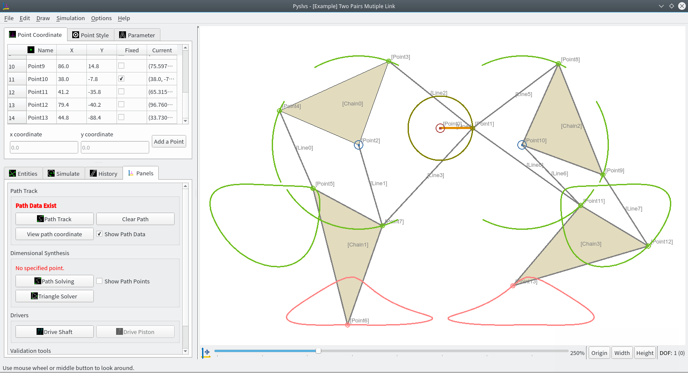
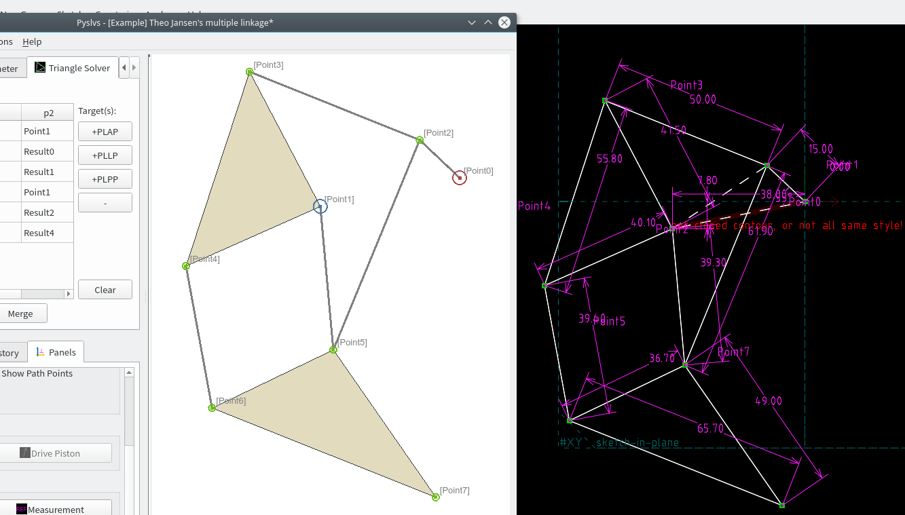

Pyslvs(PySolveSpace)
===


A GUI-based tool solving 2D linkage subject.

+ **Path tracking**: Render moving path of the points.

+ **Path solving**: This arithmetic generator will design a crank rocker to meet the path requirement.

+ **Triangle solver**: Use Solver to calculate the reference points of your mechanism by triangle constraints.

+ **Output format**: CSV, DXF and Solvespace.

Compatible with Python 3.4, PyQt 5.5 and above.



Using Solvespace C++ kernel pass to Python 3.



Requirement
---

You should install some python module first.

Linux:

```bash
$sudo pip3 install -r requirements.txt
```

Windows:

```bash
>pip install -r requirements.txt
```

How to startup
---

Open GUI by Python:

```bash
$python3 launch_pyslvs.py
```

Or see help:

```bash
$python3 launch_pyslvs.py --help
```

Compile
===

Make sure computer is installed [Qt5] and [PyQt5] in the same version.

After following operation, the executable file's folder is located at `dist` / `launch_pyslvs` folder.

As your wish, it can be renamed or moved out and operate independently in no-Python environment.

Linux
---

Use PyInstaller or cxFreeze as you like.

First, enter the storage folder.

```bash
$sudo pip3 install PyInstaller
$make
```

Windows
---

Python 3: [Anaconda] for Windows 64 bit.

Use both PyInstaller and cxFreeze to build.

Other require installation: [MinGW] for win64.

First, enter the storage folder.

```bash
>pip install cx_Freeze PyInstaller
>make
```

If you installed PyInstaller with problem of coding error, you can try another source:

```bash
>pip install https://github.com/pyinstaller/pyinstaller/archive/develop.zip
```

Collaboration
===

The manual is being written, you can look around [here](https://github.com/KmolYuan/Pyslvs-manual/).

Power By
===

Made by PyQt 5.7 and Python editor [Eric 6].

Including Python module: [PyQt5], [peewee], [dxfwrite]

Here is the **origin kernel** repository:

* [Python-solvespace]

* [Dimensional Synthesis of Planar Four-bar Linkages]

* [Triangle solver]

Build Kernel
===

Compiled kernel is in the `core` folder.

* Linux (64 bit): Python 3.4, Python 3.5

* Windows (64 bit): Python 3.5, Python 3.6

If your Python version or platform is not compatible, maybe you should build them by self.

```bash
git submodule init
git submodule update
```

Then follow the instructions in the readme.

[PyQt5]: http://doc.qt.io/qt-5/index.html
[Qt5]: https://www.qt.io/download/
[Anaconda]: https://www.continuum.io/downloads
[MinGW]: https://sourceforge.net/projects/mingw-w64/files/latest/download?source=files
[Eric 6]: http://eric-ide.python-projects.org/
[peewee]: http://docs.peewee-orm.com/en/latest/
[dxfwrite]: https://pypi.python.org/pypi/dxfwrite/

[Python-solvespace]: https://github.com/KmolYuan/python-solvespace
[Dimensional Synthesis of Planar Four-bar Linkages]: https://github.com/kmollee/django-project-template
[Triangle solver]: https://gist.github.com/KmolYuan/c5a94b769bc410524bba66acc5204a8f
