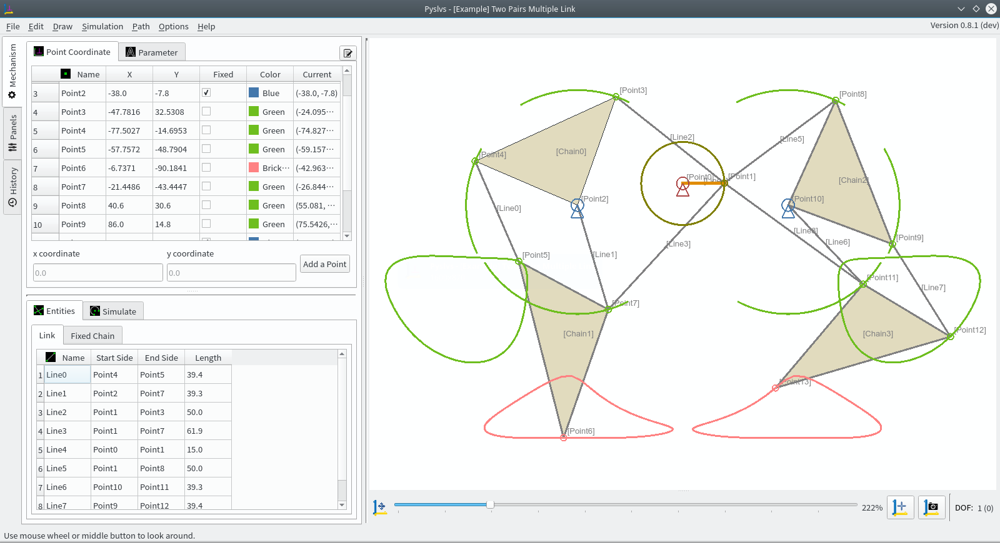
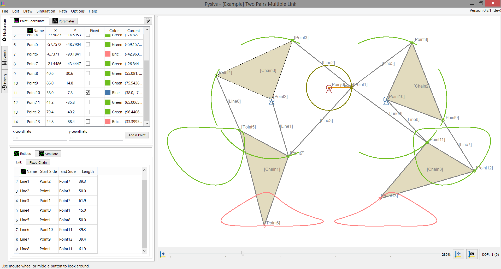

[](https://github.com/KmolYuan/Pyslvs-PyQt5/releases)
[](https://travis-ci.org/KmolYuan/Pyslvs-PyQt5)
[](https://www.python.org/)
[](https://riverbankcomputing.com/software/pyqt/intro)
[](https://github.com/KmolYuan/Pyslvs-PyQt5/releases)
[](https://github.com/KmolYuan/Pyslvs-PyQt5/releases)
[](https://raw.githubusercontent.com/KmolYuan/Pyslvs-PyQt5/master/LICENSE)


1. [Introduction](#introduction)

    + [How to startup](#how-to-startup)
    + [Symbolic](#symbolic)
    + [Path Track](#path-track)
    + [Triangle Solver](#triangle-solver)
    + [Algorithm](#algorithm)

1. [Requirement](#requirement)

    + [PyQt](#pyqt)
    + [Python-solvespace Kernel](#python-solvespace-kernel)
    + [Dimensional Synthesis Kernel](#dimensional-synthesis-kernel)

1. [Compile](#compile)

1. [Power By](#power-by)

Introduction
===

A GUI-based tool solving 2D linkage subject.

+ **Planar Linkages Simulation**: Kernel from [Solvespace] with Python bundle (SWIG).

+ **Dimensional Synthesis**: Kernel from three Cython algorithm API (rewrite).

Compatible with Python 3.4, PyQt 5.7 (for PyQtChart) and above.

Cross-platform Development: Ubuntu and Windows OS (64-bit).

**Please note that other platforms may be available but I have not tested before.**

Previews in KDE Plasma desktop:



Previews in Windows 8.1 theme:



How to startup
---

Open GUI by Python:

```bash
python3 launch_pyslvs.py
```

Or see help:

```bash
python3 launch_pyslvs.py --help
```

Symbolic
---

1. Point

    

1. Line (Link)

    

1. Chain (Fixed Chain)

    

1. Shaft (Drive Shaft)

    

1. Slider

    

1. Rod (Piston)

    

Path Track
---


Calculate the move trajectory of the node.


And view them in the table or save as text data.


Triangle Solver
---


Triangle solver find the node position by using three triangular relationship.


Then merge into canvace as well.

Algorithm
---


Contains three algorithms:

+ Real Genetic Algorithm
+ Firefly Algorithm
+ Differential Evolution

Specify a path and options to generate a crank rocker.

This function has a simple TCP ZMQ connecting mode.

Requirement
===

You should install some python module and SDK first.

The Makefile is included at compile steps, so some environment setting also should be set.

**Ubuntu**:

```bash
sudo pip3 install -r requirements.txt
```

**Windows**:

Python 3: [Official Python] for Windows 64 bit.

Makefile tool: [MinGW] for win64.

```bash
pip install -r requirements.txt
```

PyQt
---

Download [Qt5] and install it.

Remember it should include QtChart.

Make sure computer is installed Qt5 and PyQt5 in the same version.

**Ubuntu**:

Ubuntu user has to add Qt file path in user's `QTDIR`, `LD_LIBRARY_PATH`, and `PATH`.

Just like `/opt/Qt/5.9.1/gcc_64/`.

```bash
export QTDIR=/opt/Qt/5.9.1/gcc_64/

export LD_LIBRARY_PATH=${LD_LIBRARY_PATH}:${QTDIR}/lib/

export PATH=${QTDIR}/bin:${PATH}
```

Then relink QMake command (If your desktop is made by earlier Qt version).

```bash
sudo rm /usr/bin/qmake
sudo ln -s /opt/Qt/5.9.1/gcc_64/bin/qmake /usr/bin/qmake
```

Download and upgrade Python [SIP].

Before that, you should remove earlier SIP version.

```python
import sip
print(sip, sip.SIP_VERSION_STR)
```

Then remove SIP from the location:

```bash
sudo rm -fr /usr/local/lib/python3.5/dist-packages/sip*
```

Download and build [PyQt5], [QScintilla2] and [PyQtChart] by self.

**Windows**:

Windows user has to add Qt file path in environment variables, like `C:\Qt\5.9.1\msvc2015_64\bin`.

Install PyQt5, PyQtChart and QScintilla2 by pip.

```bash
pip install -U pyqt5 qscintilla pyqtchart
```

Python-solvespace Kernel
---

Make command:

```bash
make -C core/kernel/python_solvespace
```

**Ubuntu**:

First, install SWIG. This tool kit can make a Python bundle with C/C++ library.

If your not, install python development kit.

```bash
sudo apt install swig python3-dev
```

**Windows**:

Download and install [SWIG](http://www.swig.org/download.html).

Some conflicts between the Microsoft C Language and Python.

You need change a few of Python files to avoid these conflicts.

But you can be assured that the changes won't cause any negative impact.

1. **Python development settings**

    If your Python doesn't have development library, like `libpython35.a`, using `gendef` to generate it.

    First copy `python3x.dll` to `where_your_python\libs` folder.

    Then using this command:

    ```bash
    gendef python3x.dll
    dlltool --dllname python3x.dll --def python3x.def --output-lib libpython3x.a
    ```

    And then adjust source code about Visual C. Find this code in `where_your_python\include\pyconfig.h`.

    ```c
    #ifdef _WIN64
    #define MS_WIN64
    #endif
    ```

    Cut them and paste **Above** this:

    ```c
    #ifdef _MSC_VER
    ```

    Find this code in `where_your_python\Lib\distutils\cygwinccompiler.py`:

    ```python
    #with MSVC 7.0 or later.
    self.dll_libraries = get_msvcr()
    ```

    Commit `self.dll_libraries = get_msvcr()`.

1. **`math.h` conflict with `pyconfig.h`**

    You will definitely get warning with `_hypot` in `pyconfig.h`, and you should do this step.

    In `where_your_python\include\pyconfig.h`, find this:

    ```c
    #define hypot _hypot
    ```

    Edit it to this:

    ```c
    #ifndef _MATH_H_
    #define hypot _hypot
    #endif
    ```

Dimensional Synthesis Kernel
---

Make command:

```bash
make -C core/kernel/pyslvs_algorithm
```

**Ubuntu**:

Ubuntu user can compile kernel by Cython directly.

**Windows**:

If you are using 64 bit OS with 64bit Python, unfortunately you **can not** use mingw64 to complete the compilation.

Using Microsoft Visual Studio is the only option, you can get it from [here](https://www.visualstudio.com/downloads/), then startup the Visual Studio Community and install Windows SDK.

When installation finished, see the instructions [here](https://github.com/cython/cython/wiki/CythonExtensionsOnWindows#using-windows-sdk-cc-compiler-works-for-all-python-versions) to set up the Windows SDK.

Compile
===

Use PyInstaller to build.

After following operation, the executable file is located at `dist` folder.

As your wish, it can be renamed or moved out and operate independently in no-Python environment.

**Ubuntu**:

Make command:

```bash
sudo pip3 install pyinstaller
make
```

**Windows**:

Make command:

```bash
pip install pyinstaller
make
```

If you installed PyInstaller with problem of coding error, you can try another source:

```bash
pip install https://github.com/pyinstaller/pyinstaller/archive/develop.zip
```

Power By
===

Made by [Qt5] and Python IDE [Eric 6].

Including Python modules:

* [SIP] (GPLv2, GPLv3)
* [QScintilla2] (GPLv3)
* [PyQt5], [PyQtChart] (GPLv3)
* [dxfwrite] (MIT)
* [numpy] (BSD 3-Clause)
* [Cython] (Apache 2.0)
* [PyZMQ] (New BSD 3-Clause, LGPL, Apache)
* [openpyxl] (MIT)
* [psutil] (BSD)

Pyslvs is under [GNU Affero General Public License v3](https://github.com/KmolYuan/Pyslvs-PyQt5/blob/master/LICENSE).

Here is the **origin kernel** repository:

* [Python-solvespace]
* [Dimensional Synthesis of Planar Four-bar Linkages]
* [Triangle solver]

[Solvespace]: http://solvespace.com
[PyQt5]: https://www.riverbankcomputing.com/software/pyqt/download5
[PyQtChart]: https://www.riverbankcomputing.com/software/pyqtchart/download
[Qt5]: https://www.qt.io/download/
[SIP]: https://riverbankcomputing.com/software/sip/download
[QScintilla2]: https://riverbankcomputing.com/software/qscintilla/download

[Official Python]: https://www.python.org/
[MinGW]: https://sourceforge.net/projects/mingw-w64/files/

[Eric 6]: http://eric-ide.python-projects.org/

[numpy]: http://www.numpy.org/
[dxfwrite]: https://pypi.python.org/pypi/dxfwrite/
[Cython]: http://cython.org/
[PyZMQ]: http://zeromq.org/bindings:python
[openpyxl]: http://openpyxl.readthedocs.io/
[psutil]: https://github.com/giampaolo/psutil

[Python-solvespace]: https://github.com/KmolYuan/python-solvespace
[Dimensional Synthesis of Planar Four-bar Linkages]: https://github.com/kmollee/algorithm
[Triangle solver]: https://gist.github.com/KmolYuan/c5.9.14b769bc410524bba66acc5204a8f
