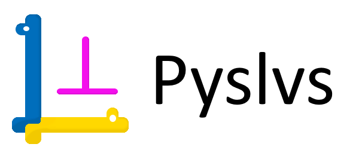

[](https://github.com/KmolYuan/Pyslvs-UI/releases/latest)
[](https://ci.appveyor.com/project/KmolYuan/pyslvs-pyqt5)
[](https://travis-ci.org/KmolYuan/Pyslvs-UI)
[](https://pyslvs-ui.readthedocs.io/en/latest/?badge=latest)
[](https://github.com/KmolYuan/Pyslvs-UI/releases)
[](https://github.com/KmolYuan/Pyslvs-UI/releases)

[](https://github.com/KmolYuan/solvespace)
[](https://github.com/KmolYuan/pyslvs)
[](https://pypi.org/project/pyslvs-ui/)
[](https://sourceforge.net/projects/pyslvs/)
[](http://www.pyslvs.com/blog/index.html)
[](http://www.pyslvs.com/content/)



# Introduction

A GUI-based ([PyQt5]) tool used to design 2D linkage mechanism.

+ **Planar Linkages Simulation**

    - [Python-Solvespace]: Kernel from [Solvespace] with Cython bundle.
    - [Pyslvs]: Kernel from [Sketch Solve] with Cython.

+ **Mechanical Synthesis**

    - **Number Synthesis**: Combine the attributes of mechanism.
    - **Structural Synthesis**: Cython algorithm used to find out structural possibilities of the mechanism.
    - **Dimensional Synthesis**: Kernel from the three Cython algorithms (rewrite).

+ **Others**

    - Cross three platforms.
    - CAD-like user interface.
    - Auto layout of generalized chain.
    - The code complies with PEP8.

# Documentation

The documentation of Pyslvs and kernel API are deployed on Readthedocs ([stable] / [latest]).

Or start it from source:

```bash
pip install mkdocs
pip install -r doc-requirements.txt
mkdocs serve
```

If you have any question, please post on GitHub issue or contact <pyslvs@gmail.com>.

[PyQt5]: https://www.riverbankcomputing.com/software/pyqt/download5
[Solvespace]: http://solvespace.com
[Python-Solvespace]: https://github.com/KmolYuan/solvespace
[Pyslvs]: https://github.com/KmolYuan/pyslvs
[Sketch Solve]: https://code.google.com/archive/p/sketchsolve/

[stable]: https://pyslvs-ui.readthedocs.io/en/stable/
[latest]: https://pyslvs-ui.readthedocs.io/en/latest/
