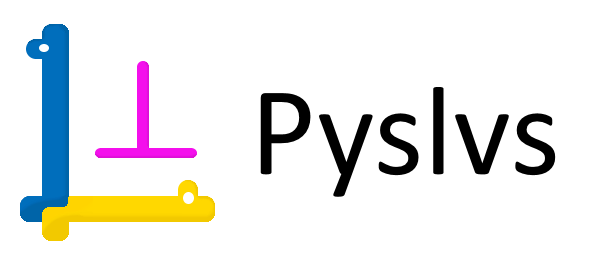
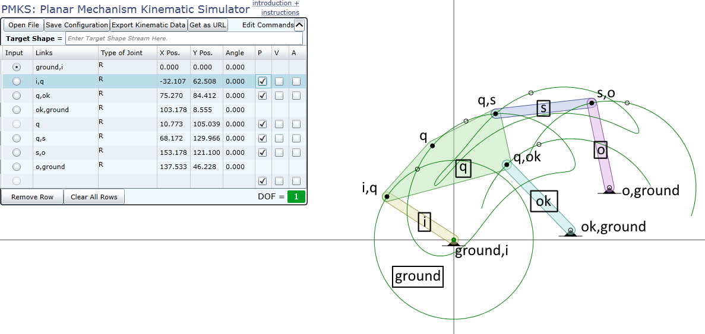
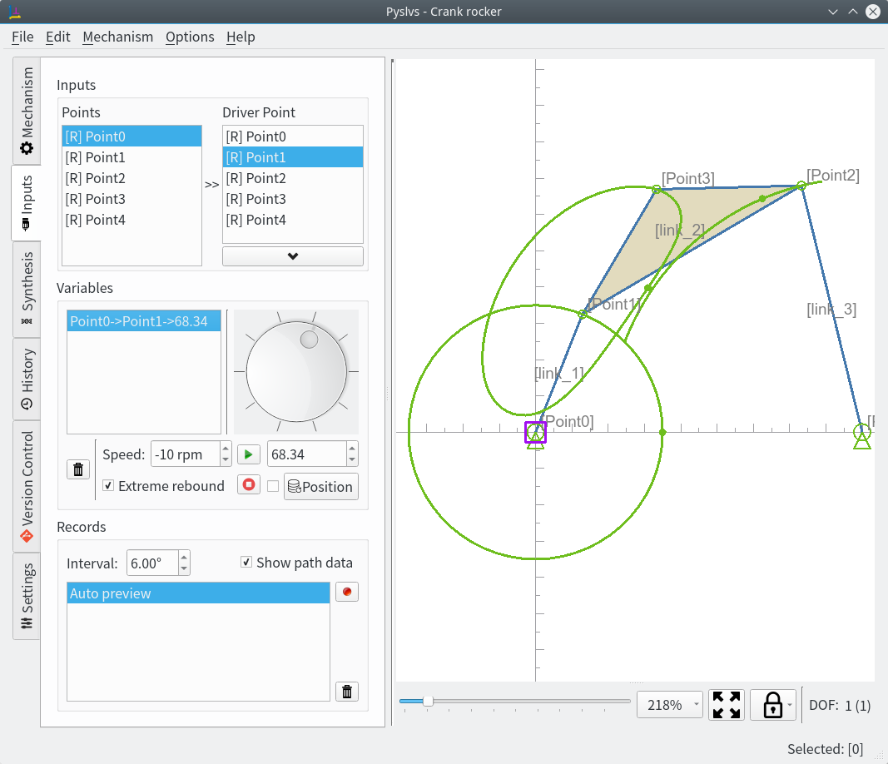
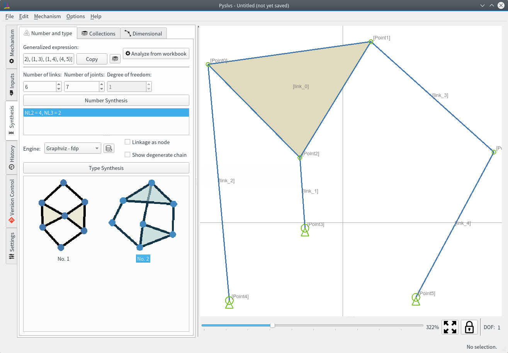
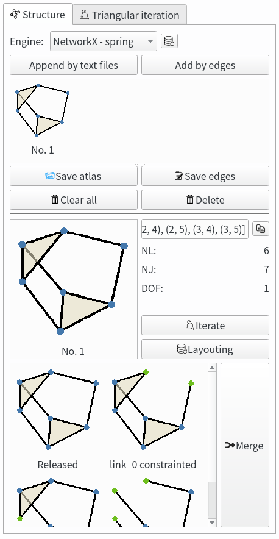
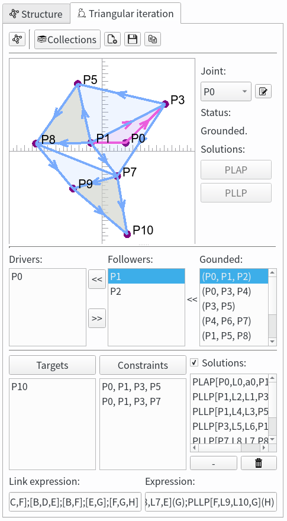
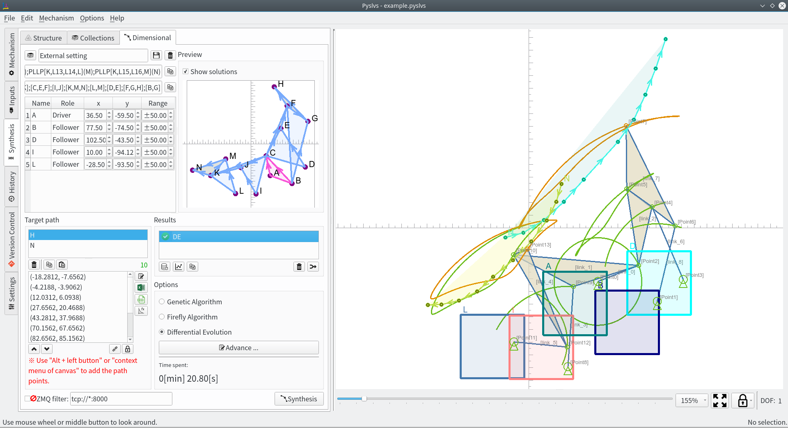
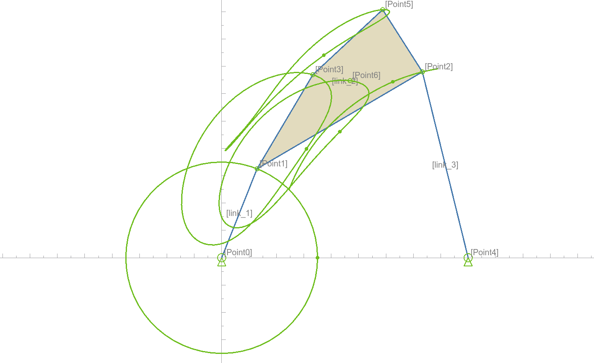
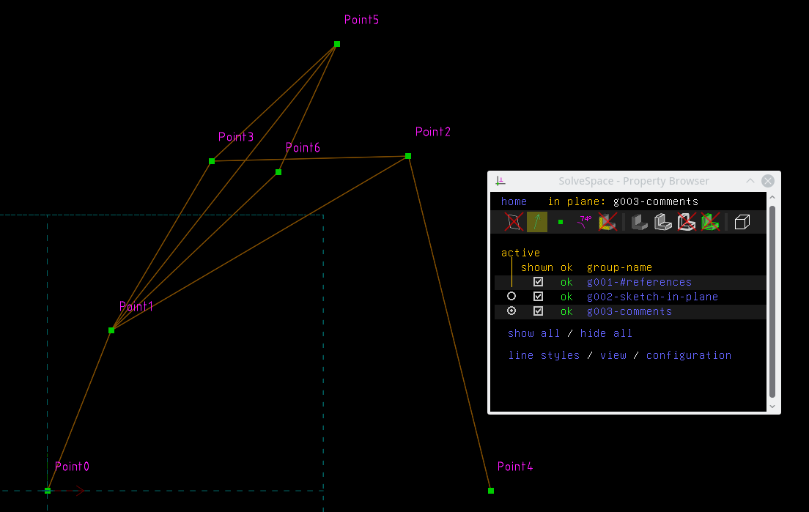

[](https://github.com/KmolYuan/Pyslvs-PyQt5/releases/latest)
[](https://travis-ci.org/KmolYuan/Pyslvs-PyQt5)
[](https://www.python.org/)
[](https://riverbankcomputing.com/software/pyqt/intro)
[-blue.svg)](https://github.com/KmolYuan/Pyslvs-PyQt5/releases)
[](https://github.com/KmolYuan/Pyslvs-PyQt5/releases)
[](https://raw.githubusercontent.com/KmolYuan/Pyslvs-PyQt5/master/LICENSE)



Website: <http://www.pyslvs.com/blog/index.html>

Pyslvs on [Sourceforge](https://sourceforge.net/projects/pyslvs/).

1. [Introduction](#introduction)

    + [How to startup](#how-to-startup)
    + [Symbolic](#symbolic)
    + [Kinematics Simulation](#kinematics-simulation)
    + [Number and Type Synthesis](#number-and-type-synthesis)
    + [Triangular iteration](#triangular-iteration)
    + [Dimensional Synthesis](#dimensional-synthesis)
    + [IO Support](#io-support)

1. [Modules Requirement](#modules-requirement)

    + [Graphviz (Optional)](#graphviz-optional)
    + [PyQt Stuff (Development)](#pyqt-stuff-development)

1. [Kernels Requirement](#kernels-requirement)

    + [Cython Kernel](#cython-kernel)
    + [Python-Solvespace Kernel](#python-solvespace-kernel)

1. [Stand-alone Executable File](#stand-alone-executable-file)

1. [Powered By](#powered-by)

# Introduction

A GUI-based tool use to solving 2D linkage subject.

+ **Planar Linkages Simulation**: Kernel from [Solvespace] with Python bundle (SWIG).

+ **Mechanical Synthesis**:

    - **Number and Type Synthesis**: Cython algorithm use to find out structure possibilities of the mechanism.
    - **Dimensional Synthesis**: Kernel from three Cython algorithm API (rewrite).

Compatible with Python 3.5, PyQt 5.10 (same as PyQtChart) and above.

Cross-platform Development: Ubuntu and Windows (64-bit).

**Please note that the other platforms may be available but I have not tested before.**

Previews in KDE Plasma desktop:


Previews in Windows 8.1 theme:


## How to startup

Here's some command line options for Pyslvs.

```bash
#Download or update submodule:
git submodule init
git submodule update

#After following compile steps:
make build-kernel

#Open GUI by Python:
python launch_pyslvs.py

#Or see the help:
python launch_pyslvs.py --help

#Run the unit test:
python test_pyslvs.py
```

## Symbolic

Referring symbolic from [PMKS](http://designengrlab.github.io/PMKS/).

1. Point

    

1. Link

    

The PMKS expression is using a name label to present a link bar.

A joint between two links will get two name labels, and so on.

The "ground" label is a default name, this link will be the absolute coordinate in the system, might be a frame of your mechanism.



Pyslvs was translate the PMKS expression as a string, likes below:

```python
#Single line annotation.
M[
    J[R, color[Green], P[0.0, 0.0], L[ground, link_0]],
    J[R, color[Green], P[12.92, 32.53], L[link_0, link_1]],
    J[R, color[Green], P[73.28, 67.97], L[link_1, link_2]],
    J[R, color[Green], P[33.3, 66.95], L[link_1]],
    J[R, color[Green], P[90.0, 0.0], L[ground, link_2]],
]
```

Then the expression can be parse in Pyslvs to create the mechanism.

The grammar is defined with Extended Backus–Naur Form (EBNF), you can checkout the source code of parser.

## Kinematics Simulation

Pyslvs has a simple simulation function for revolute joints.



Choose a base link and a drive link for the joint, then add the dependent into variables list.

Using QDial widget (it just like a turntable) to adjust the angle value of variable.

Path data will start append coordinates (between a certain of distance) after press the "record" button. Press "record" button again to stop recording.

Path data can be copy or switch visibility by right-click menu.

Some exceptions are not support:

+ Other type of joints.
+ Degree of freedom was lower than 1 but still can moving.

## Number and Type Synthesis

Analysis a type of mechanism that exists, and find out other possibilities.



We have a topological algorithm to combine atlas with:

+ Same degree of freedom.
+ Same number of link.
+ Same number of joint.

And use a type of mechanism to do grounding combine.



Grounding combine can merge the structure diagram immediately to canvas.

But in the common ways, you can give it to dimensional synthesis to make it more useful.

## Triangular iteration

Before doing dimensional synthesis, a structure diagram has to configure it's verification formula.



**PLAP** function is using two known points, a length variable and an angle variable to find out the position of third point.

**PLLP** function is using two known points and two length variables to find out the position of third point.

When the structure profile is complete, is time to doing dimensional synthesis!

## Dimensional Synthesis

Generate a mechanism with path requirement by random variables.

+ The structure settings is get from triangular iteration.
+ There also have algorithm options, such like constraints or probability.



Contains three algorithms:

+ Real Genetic Algorithm
+ Firefly Algorithm
+ Differential Evolution

Specify a path and options to generate a crank rocker.

Three kinds of task target:

+ Stop at the maximum generation.
+ Get the minimum fitness value.
+ Stop at the maximum time.

## IO Support

Pyslvs can support for following format.

**Output formats**:

+ Pyslvs workbook database (*.pyslvs).
+ Expression (just a string).
+ [Solvespace] format (*.slvs).
+ DXF format (*.dxf).
+ Image capture (all of [Qt supports]).

[Solvespace]: https://github.com/solvespace/solvespace
[Qt supports]: http://doc.qt.io/qt-5/qimage.html#reading-and-writing-image-files

**Input formats**:

+ Pyslvs workbook database (*.pyslvs).
+ Expression (just a string).
+ Solvespace format (*.slvs, only supports very few of constraints).

The workbook mechanism will generate the sketch frame as *.slvs format like follow:





A part file will split the sketch and boundary with two groups.


The part files can be import to assemble with main sketch file. However, the 3D features still can not be generated from external program yet, so user need to do it by self.

For the IO method of Solvespace format, you can also refer to two Python scripts 'read' and 'write' in Pyslvs IO module.

# Modules Requirement

You should install some python module and SDK first.

The Makefile is included at compile steps, so some environment setting also should be set.

**Ubuntu**:

```bash
$ sudo pip3 install -r requirements.txt
```

**Windows**:

Python 3: [Official Python] for Windows 64 bit.

Makefile tool: [MinGW] or [Msys 2][msys].

```bash
> pip install -r requirements.txt
```

## Graphviz (Optional)

Graphviz tools provide some graph engine that can make the position of dots in atlas looks more pretty.

Download it from [here](https://www.graphviz.org/) or:

```bash
$ sudo apt install graphviz
```

Windows user please make sure to add Graphviz `bin` folder path to environment variables.

Then use the `dot` command to check if it works.

If you are not willing to install Graphviz, you can just using built-in layout from NetworkX.

## PyQt Stuff (Development)

PyQt5 and QtChart are now pack into the wheel file that Windows and Ubuntu can use them.

When the installation is complete by pip, some stuff need to remind you.

Qt tools can use to design the user interface, they are not the requirement if you just want to run Pyslvs.

**Ubuntu**:

Download [Qt5] and install it, then we will get the tools.

If your desktop is made by earlier Qt version, you should install in another place.

Download and install / upgrade [SIP].

```python
>>> import sip
>>> print(sip, sip.SIP_VERSION_STR)
```

Then remove SIP from the location:

```bash
$ sudo rm -fr /usr/local/libs/python3.5/dist-packages/sip*
```

Or maybe directly:

```bash
$ sudo pip3 install sip -U
```

**Windows**:

Windows user can get Qt tools by pip, and don't need to install Qt package.

```bash
> pip install pyqt5-tools
```

# Kernels Requirement

Make command:

```bash
make build-kernel
```

This project including two kernels should build, please following the steps if you are first time to use.

## Cython Kernel

Cython libraries of Pyslvs, including:

1. Solver:
    + parser
    + tinycadlib
    + triangulation
1. Dimensional synthesis:
    + planarlinkage
    + rga
    + firefly
    + de
1. Number synthesis:
    + number
1. Topologic synthesis:
    + topologic

This module only require "[Lark-parser]" module (and [Pygments] provide highlighting optionaly), so it can works independently without to startup GUI.

Make command:

```bash
make build-pyslvs
```

**Ubuntu**:

Ubuntu user can compile the kernel by Cython directly.

**Windows**:

There's two options to choose SDK:

1. Using Microsoft Visual Studio. You can get it from [here][visualstudio-link], then startup the Visual Studio Community and install Windows SDK.
1. Using [Msys 2][msys]. It is based on MinGW 64-bit version.
1. Just using [MinGW 64-bit][mingw64].

[visualstudio-link]: https://www.visualstudio.com/downloads/
[msys]: http://www.msys2.org/
[mingw64]: https://sourceforge.net/projects/mingw-w64/

When using MinGW, you can refer the steps of this article: <https://stackoverflow.com/questions/34135280/valueerror-unknown-ms-compiler-version-1900>

## Python-Solvespace Kernel

Make command:

```bash
make -C core/libs/python_solvespace
```

**Ubuntu**:

First, install SWIG. This tool kit can make a Python bundle with C/C++ library.

If your not, install python development kit.

```bash
sudo apt install swig python3-dev
```

**Windows**:

Download and install [SWIG](http://www.swig.org/download.html).

If your Python doesn't have development library, like `libpython35.a`, using `gendef` to generate it.

**In Python 3.6 and above versions, you do not have to get lib file.**

First copy `python3x.dll` to `where_your_python\libs` folder.

Then using this command:

```bash
gendef python3x.dll
dlltool --dllname python3x.dll --def python3x.def --output-lib libpython3x.a
```

You need to modify a few of Python files to avoid these conflicts before compile the library. But you can be assured that the changes won't cause any negative impact.

Find this code in `where_your_python\Lib\distutils\cygwinccompiler.py`:

```python
# no additional libraries needed
self.dll_libraries=[]

# Include the appropriate MSVC runtime library if Python was built
# with MSVC 7.0 or later.
self.dll_libraries = get_msvcr()
```

Note out `self.dll_libraries = get_msvcr()`.

And then adjust source code about Virtual Studio. Find this code in `where_your_python\include\pyconfig.h`.

```c
#ifdef _WIN64
#define MS_WIN64
#endif
```

Cut them and paste **Above** this:

```c
#ifdef _MSC_VER
```

You also will get warning with `_hypot` in `pyconfig.h`, and you should do this step.

In `where_your_python\include\pyconfig.h`, find this:

```c
#define COMPILER "[gcc]"
#define hypot _hypot
```

Edit it to this:

```c
#define COMPILER "[gcc]"
#ifndef _MATH_H_
#define hypot _hypot
#endif
```

# Stand-alone Executable File

As your wish, it can be renamed or moved out and operate independently in no-Python environment.

**Ubuntu**:

Use shell command to build as [AppImage](https://github.com/AppImage/AppImages).

After following operation, the executable file is in `out` folder.

Make command:

```bash
$ sudo pip3 install virtualenv
$ make
```

**Windows**:

Use PyInstaller to build.

After following operation, the executable file is in `dist` folder.

Make command:

```bash
> pip install pyinstaller
> make
```

# Powered By

Made by [Qt5] and Python IDE [Eric 6].

If there is no special reason, please install the new version of the kits.

Including Python modules:

* [SIP] (GPLv2, GPLv3)
* [PyQt5], [PyQtChart] (GPLv3)
* [ezdxf] (MIT)
* [numpy] (BSD 3-Clause)
* [Cython] (Apache 2.0)
* [openpyxl] (MIT)
* [psutil] (BSD)
* [peewee] (MIT)
* [Lark-parser] (MIT)
* [NetworkX] (BSD 3-Clause)
* [Pydot] (MIT)
* [Pygments] (BSD)

Pyslvs is under [GNU Affero General Public License v3].

Kernel repository:

* [Python-solvespace]
* [Pyslvs]

[Solvespace]: http://solvespace.com
[PyQt5]: https://www.riverbankcomputing.com/software/pyqt/download5
[PyQtChart]: https://www.riverbankcomputing.com/software/pyqtchart/download
[Qt5]: https://www.qt.io/download/
[SIP]: https://riverbankcomputing.com/software/sip/download

[Official Python]: https://www.python.org/
[MinGW]: https://sourceforge.net/projects/mingw-w64/files/

[Eric 6]: http://eric-ide.python-projects.org/

[numpy]: http://www.numpy.org/
[ezdxf]: https://ezdxf.readthedocs.io/en/latest/index.html
[Cython]: http://cython.org/
[openpyxl]: http://openpyxl.readthedocs.io/
[psutil]: https://github.com/giampaolo/psutil
[peewee]: http://docs.peewee-orm.com/en/latest/
[Lark-parser]: https://github.com/erezsh/lark
[NetworkX]: https://networkx.github.io/
[Pydot]: https://github.com/erocarrera/pydot
[Pygments]: http://pygments.org/

[Python-solvespace]: https://github.com/KmolYuan/python-solvespace
[Pyslvs]: https://github.com/KmolYuan/pyslvs

[GNU Affero General Public License v3]: https://github.com/KmolYuan/Pyslvs-PyQt5/blob/master/LICENSE
