+ [Introduction](#introduction)

+ [Requirement](#requirement)

+ [Power By](#power-by)

Introduction
===

A GUI-based tool solving 2D linkage subject.

+ **Planar Linkages Simulation**: Kernel from Solvespace Python bundle.

+ **Dimensional Synthesis**: Kernel from three Cython algorithm API.

Compatible with Python 3.4, PyQt 5.5 and above.

Cross-platform Development: Ubuntu and Windows OS

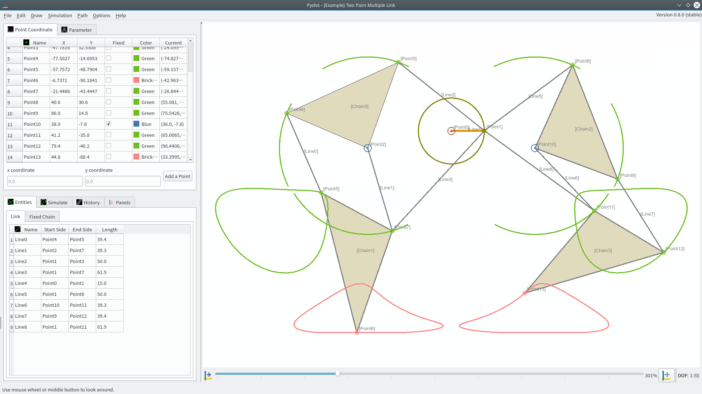

How to startup
---

Open GUI by Python:

```bash
$python3 launch_pyslvs.py
```

Or see help:

```bash
$python3 launch_pyslvs.py --help
```

Symbolic
---

1. Point

    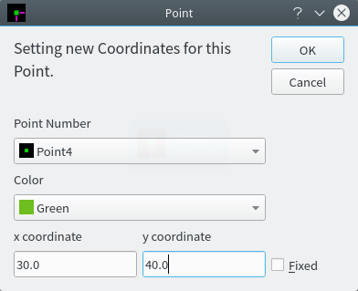

1. Line (Link)

    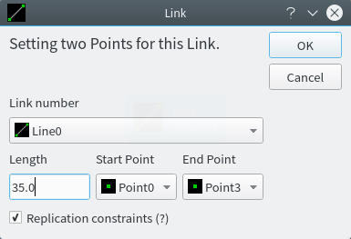

1. Chain (Fixed Chain)

    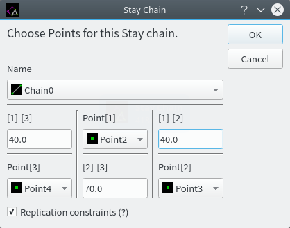

1. Shaft (Drive Shaft)

    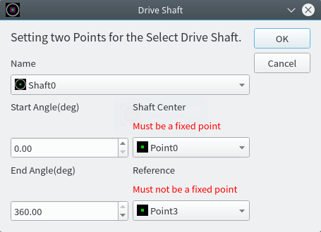

1. Slider

    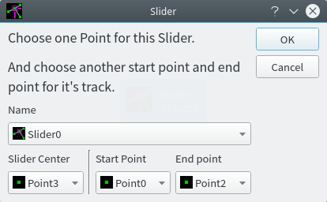

1. Rod (Piston)

    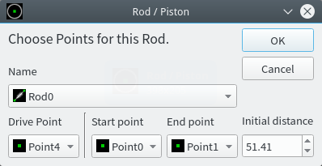

Path Track
---

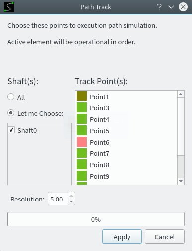

Calculate the path of the node.

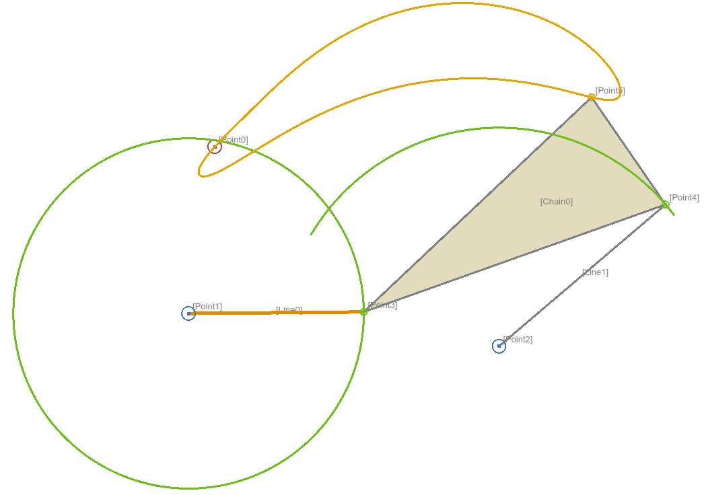

View them in the table.

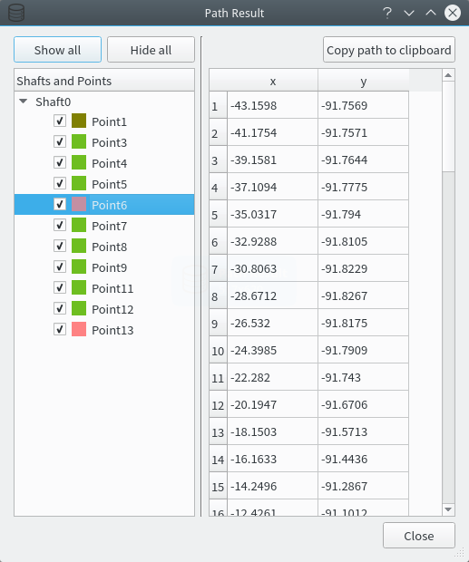

Triangle Solver
---


Triangle solver find the node position by using three triangular relationship.

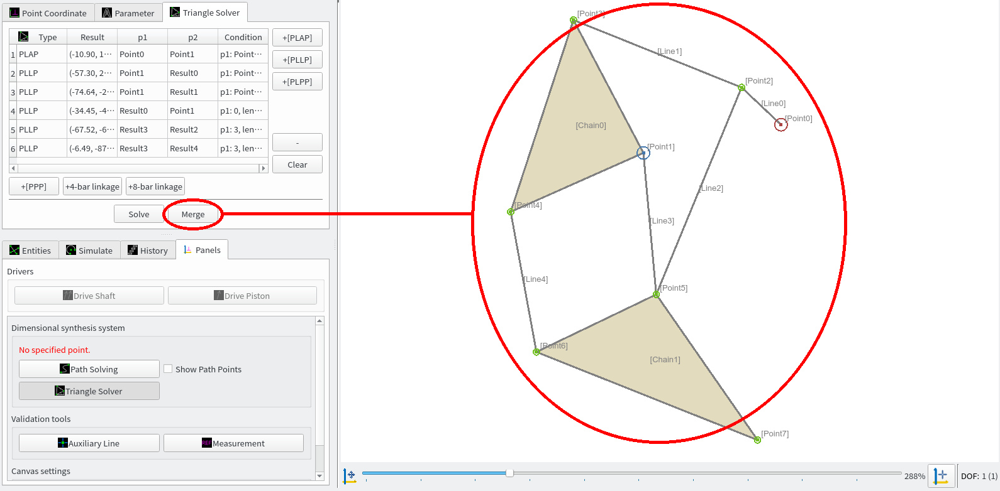

Then merge into canvace as well.

Algorithm
---

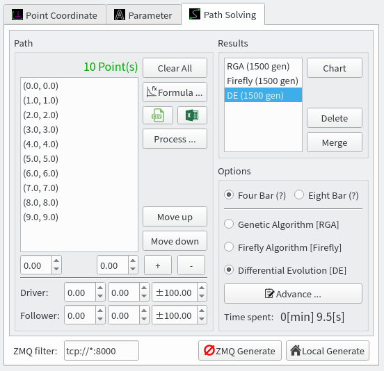

Contains three algorithms:

+ Genetic Algorithm
+ Firefly Algorithm
+ Differential Evolution

Specify a path and options to generate a crank rocker.

Requirement
===

You should install some python module first.

**Linux**:

```bash
$sudo pip3 install -r requirements.txt
```

**Windows**:

```bash
>pip install -r requirements.txt
```

PyQt
---

Download [Qt] and install it.

Make sure computer is installed Qt5 and PyQt5 in the same version.

**Linux**:

Linux OS has to add Qt file path in user's `.bashrc`, like `/opt/Qt/5.8/gcc_64/`.

```bash
export QTDIR=/opt/Qt/5.8/gcc_64/

export LD_LIBRARY_PATH=${LD_LIBRARY_PATH}:${QTDIR}/lib/

export PATH=${QTDIR}/bin:${PATH}
```

Then relink QMake command (If your desktop is made by earlier Qt version).

```bash
$sudo rm /usr/bin/qmake
$sudo ln -s /opt/Qt/5.8/gcc_64/bin/qmake /usr/bin/qmake
```

Upgrade Python [SIP].

```bash
$sudo rm -f /usr/lib/python3/dist-packages/sip*
```

Download and build [PyQt5], [PyQtChart] and [QScintilla2] by self.

**Windows**:

Windows OS has to add Qt file path in environment variables, like `C:\Qt\5.8\msvc2015_64\bin`.

Install PyQt5, PyQtChart and QScintilla2 by pip.

```bash
>pip install -U pyqt5 qscintilla2 pyqtchart
```

Compile
===

Use PyInstaller to build.

After following operation, the executable file's folder is located at `dist` / `launch_pyslvs` folder.

As your wish, it can be renamed or moved out and operate independently in no-Python environment.

**Linux**:

First, enter the storage folder.

```bash
$sudo pip3 install pyinstaller
$make
```

**Windows**:

Python 3: [Official Python] for Windows 64 bit.

Makefile tool: [MinGW] for win64.

First, enter the storage folder.

```bash
>pip install pyinstaller
>make
```

If you installed PyInstaller with problem of coding error, you can try another source:

```bash
>pip install https://github.com/pyinstaller/pyinstaller/archive/develop.zip
```

Power By
===

Made by [Qt5] and Python IDE [Eric 6].

Including Python module: [PyQt5], [peewee], [dxfwrite]

Here is the **origin kernel** repository:

* [Python-solvespace]

* [Dimensional Synthesis of Planar Four-bar Linkages]

* [Triangle solver]

Kernel
---

Compiled binary files is in the `core/kernel` folder.

* Ubuntu (64 bit): Python 3.4, Python 3.5

* Windows (64 bit): Python 3.5, Python 3.6

If your Python version or platform is not compatible, maybe you should build them by self.

```bash
git submodule init
git submodule update
```

Then follow the instructions in the readme.

[PyQt5]: https://www.riverbankcomputing.com/software/pyqt/download5
[PyQtChart]: https://www.riverbankcomputing.com/software/pyqtchart/download
[Qt5]: https://www.qt.io/download/
[SIP]: https://riverbankcomputing.com/software/sip/download
[QScintilla2]: https://riverbankcomputing.com/software/qscintilla/download

[Official Python]: https://www.python.org/
[MinGW]: https://sourceforge.net/projects/mingw-w64/files/

[Eric 6]: http://eric-ide.python-projects.org/
[peewee]: http://docs.peewee-orm.com/en/latest/
[dxfwrite]: https://pypi.python.org/pypi/dxfwrite/

[Python-solvespace]: https://github.com/KmolYuan/python-solvespace
[Dimensional Synthesis of Planar Four-bar Linkages]: https://github.com/kmollee/algorithm
[Triangle solver]: https://gist.github.com/KmolYuan/c5a94b769bc410524bba66acc5204a8f
