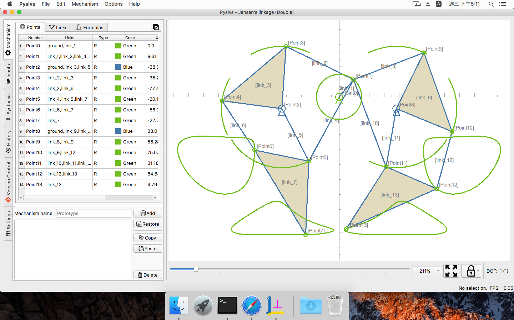

[](https://github.com/KmolYuan/Pyslvs-PyQt5/releases/latest)
[](https://ci.appveyor.com/project/KmolYuan/pyslvs-pyqt5)
[](https://travis-ci.org/KmolYuan/Pyslvs-UI)
[](https://github.com/KmolYuan/Pyslvs-UI/releases)
[](https://github.com/KmolYuan/Pyslvs-UI/releases)
[](https://github.com/KmolYuan/Pyslvs-UI/blob/master/LICENSE)

[](https://riverbankcomputing.com/software/pyqt/intro)
[](https://github.com/KmolYuan/python-solvespace)
[](https://github.com/KmolYuan/pyslvs)

[](https://sourceforge.net/projects/pyslvs/)
[](http://www.pyslvs.com/blog/index.html)
[](http://www.pyslvs.com/content/)


1. [Introduction](#introduction)

    + [Design Method](#design-method)
    + [How to Startup](#how-to-startup)
    + [Symbolic](#symbolic)
    + [Kinematics Simulation](#kinematics-simulation)
    + [Structural Synthesis](#structural-synthesis)
    + [Structural Configuration](#structural-configuration)
    + [Dimensional Synthesis](#dimensional-synthesis)
    + [IO Support](#io-support)

1. [Modules Requirement](#modules-requirement)

    + [PyQt Stuff (Development)](#pyqt-stuff-development)

1. [Kernels Requirement](#kernels-requirement)

    + [Pyslvs Kernel](#pyslvs-kernel)
    + [Python-Solvespace Kernel](#python-solvespace-kernel)

1. [Stand-alone Executable File](#stand-alone-executable-file)

1. [Powered By](#powered-by)

# Introduction

A GUI-based tool used to design 2D linkage mechanism.

+ **Planar Linkages Simulation**

    - [Python-Solvespace]: Kernel from [Solvespace] with Cython bundle.
    - [Pyslvs]: Kernel from [Sketch Solve] with Cython.

+ **Mechanical Synthesis**

    - **Number Synthesis**: Combine the attributes of mechanism.
    - **Structural Synthesis**: Cython algorithm used to find out structural possibilities of the mechanism.
    - **Dimensional Synthesis**: Kernel from the three Cython algorithms (rewrite).

+ **Others**

    - Cross three platforms.
    - CAD-like user interface.
    - Auto layout of generalized chain.
    - The code complies with PEP8.

Previews in Ubuntu with KDE Plasma desktop:


Previews in Windows 10 theme:


Previews in macOS Sierra with fusion theme:



## Design Method

![computer_aid_design_method]

Three-steps design flow:

+ Structure Synthesis
+ Dimensional Synthesis
+ Kinematic Simulation

Including sequential processes and inverse analysis.

[computer_aid_design_method]: images/computer_aid_design_method_watermark.png

## How to Startup

Here's some command line options for Pyslvs.

```bash
# Download / update submodule:
git submodule update --init --recursive

# After following compile steps:
make build-kernel

# Open GUI by Python:
python launch_pyslvs.py

# Open GUI with Fusion style:
python launch_pyslvs.py --fusion

# Or see the help:
python launch_pyslvs.py --help

# Pack into stand-alone executable file:
make
```

## Symbolic

Referring symbolic from [PMKS](http://designengrlab.github.io/PMKS/).

The PMKS expression is using a name label to present a link bar.

A joint between two links will get two name labels, and so on.

The "ground" label is a default name, this link will be the absolute coordinate in the system, might be a frame of your mechanism.


Pyslvs was translate the PMKS expression as a string, likes below:

```pmks
# Single line annotation.
M[
    J[R, color[Green], P[0.0, 0.0], L[ground, link_0]],
    J[R, color[Green], P[12.92, 32.53], L[link_0, link_1]],
    J[R, color[Green], P[73.28, 67.97], L[link_1, link_2]],
    J[R, color[Green], P[33.3, 66.95], L[link_1]],
    J[R, color[Green], P[90.0, 0.0], L[ground, link_2]],
]
```

Then the expression can be parse in Pyslvs to create the mechanism.

The grammar is defined with Extended Backus–Naur Form (EBNF), you can checkout the source code of parser.

## Kinematics Simulation

Pyslvs has a simple simulation function driving with revolute joints.

There is a planar constraint solving mechanism done with three CAD kernels:

+ Pyslvs and Sketch Solve.
+ Python-Solvespace.
+ Sketch Solve.

Choose a base point and a driver point for the shaft, then add this dependent into variables list.

Using QDial widget (it just like a turntable) to adjust the angle value of variable.

Path data will start append coordinates (between a certain of distance) after press the "record" button. Press "record" button again to stop recording.

Path data can be copy or switch visibility by right-click menu.

Some exceptions are not support:

+ Other type of joints.
+ Degree of freedom was lower than 1 but still can moving.

## Structural Synthesis

Analysis a type of mechanism that exists, and find out other possibilities.

We have a topological algorithm to combine atlas with:

+ Same degree of freedom.
+ Same number of link.
+ Same number of joint.

And use a type of mechanism to do grounding combine.

Grounding combine can merge the structure graph immediately to canvas.

But in the common ways, you can give it to dimensional synthesis to make it more useful.

## Structural Configuration

Before doing dimensional synthesis, a structure graph has same option when mapping to target mechanism.

+ Grounded link: The link is used as mechanism frame.
+ Inputs: Mechanism angle variables decided by joint pairs.
+ Target joints: Several joints that need to match target paths.

Result variable configuration will have:

+ Position of grounded joints.
+ Length of links.
+ Inputs angle.

## Dimensional Synthesis

Generate a mechanism with path requirement by random variables.

+ The structure settings is get from variable configuration.
+ There also have algorithm options, such like constraints or probability.

Contains three algorithms:

+ Real-coded Genetic Algorithm
+ Firefly Algorithm
+ Differential Evolution

## IO Support

Pyslvs can support for following format.

**Output formats**:

+ Pyslvs workbook database (*.pyslvs).
+ Expression (just a string).
+ [Solvespace] format (*.slvs).
+ DXF format (*.dxf).
+ Image capture (all of [Qt supports]).

[Solvespace]: https://github.com/solvespace/solvespace
[Qt supports]: http://doc.qt.io/qt-5/qimage.html#reading-and-writing-image-files

**Input formats**:

+ Pyslvs workbook database (*.pyslvs).
+ Expression (just a string).
+ Solvespace format (*.slvs, only supports very few of constraints).

The workbook mechanism will generate the sketch frame as \*.slvs format like follow:


A part file will split the sketch and boundary with two groups.


The part files can be import to assemble with main sketch file. However, the 3D features still can not be generated from external program yet, so user need to do it by self.

For the IO method of Solvespace format, you can also refer to two Python scripts 'read' and 'write' in Pyslvs IO module.

# Modules Requirement

Actual testing platforms with CI:

+ 
+ 
+ 

**Please note that the other platforms may be available but I have not tested before.**

**Mac OS and Ubuntu**:

```bash
# Local Python
pip3 install -r requirements.txt

# Global Python
sudo pip3 install -r requirements.txt
```

**Windows**:

Python 3: [Official Python] for Windows 64 bit.

Makefile tool: [MinGW] or [Msys 2][msys].

```bash
pip install -r requirements.txt
```

## PyQt Stuff (Development)

PyQt5 and QtChart are now pack into the wheel file that Windows and Ubuntu can install them directly.

Qt tools can be used to design the *.ui files, they are not the requirement if you just want to run Pyslvs.

**Mac OS and Ubuntu**:

Download and install [Qt5] to get the tools.

**Windows**:

Windows user can get Qt tools by pip (maybe not newest version), without to install Qt package.

```bash
pip install pyqt5-tools
```

# Kernels Requirement

About the development tools, please see [Modules Requirement](#modules-requirement).

Make command:

```bash
make build-kernel
```

This project including two kernels should build.

## Pyslvs Kernel

[Pyslvs]\: Core libraries of this project.

Make command:

```bash
make build-pyslvs
```

**Mac OS and Ubuntu**:

User can compile the kernel by Cython directly.

**Windows**:

There's two options to choose SDK:

1. Using Microsoft Visual Studio. You can get it from [here][visualstudio-link], then startup the Visual Studio Community and install Windows SDK.
1. Using [Msys 2][msys]. It is based on MinGW 64-bit version.
1. Just using [MinGW 64-bit][mingw64].

[visualstudio-link]: https://www.visualstudio.com/downloads/
[msys]: http://www.msys2.org/
[mingw64]: https://sourceforge.net/projects/mingw-w64/

When using MinGW for Python compiler, following command might be helpful:

```bash
# Where %PYTHON_DIR% is the directory of your Python installation.
# In Pyslvs project.

# Create "distutils.cfg"
echo [build]>> %PYTHON_DIR%\Lib\distutils\distutils.cfg
echo compiler = mingw32>> %PYTHON_DIR%\Lib\distutils\distutils.cfg

# Apply the patch of "cygwinccompiler.py".
# Unix "patch" command of Msys.
patch %PYTHON_DIR%\lib\distutils\cygwinccompiler.py platform\patch.diff
# Also can use "git apply".
copy platform\patch.diff %PYTHON_DIR%\lib\distutils
cd %PYTHON_DIR%\lib\distutils
git apply patch.diff
rd apply patch.diff /s /q

# Copy "vcruntime140.dll" to "libs".
copy %PYTHON_DIR%\vcruntime140.dll %PYTHON_DIR%\libs
```

And it will be useful if Make tool in Msys can't find Windows command (such like `copy`, `rd` or `del`):

```makefile
ifeq ($(OS),Windows_NT)
    # Rewrite "SHELL" variable.
    SHELL = cmd
endif
```

## Python-Solvespace Kernel

[Python-Solvespace]\: Python bundle of [Solvespace] library.

Make command:

```bash
make build-solvespace
```

The compile steps of this kernel has same way as Pyslvs kernel.

# Stand-alone Executable File

As your wish, it can be renamed or moved out and operate independently in no-Python environment.

**Ubuntu**:

Use shell command to build as [AppImage].

After following operation, the executable file is in `out` folder.

Make command:

```bash
sudo pip3 install virtualenv
make
```

**Mac OS and Windows**:

Use PyInstaller to build.

After following operation, the executable file is in `dist` folder.

Make command:

```bash
pip install pyinstaller
make
```

On Mac OS, PyInstaller will generate two executable files (refer [here][pinstaller-mac]).

[pinstaller-mac]: https://pyinstaller.readthedocs.io/en/stable/usage.html#building-mac-os-x-app-bundles

```bash
# Run Unix-like executable file.
# Can not run it directly in Finder.
./executable --use-arguments-here

# Run Mac app file. (Can not use any arguments)
# Same as double click it in Finder.
open ./executable.app
```

# Powered By

Made by [Qt5].

If there is no special reason, please install the newest version of the kits.

Including Python modules:

* [SIP] (GPLv2, GPLv3)
* [PyQt5], [PyQtChart] (GPLv3)
* [ezdxf] (MIT)
* [numpy] (BSD 3-Clause)
* [Cython] (Apache 2.0)
* [openpyxl] (MIT)
* [psutil] (BSD)
* [peewee] (MIT)
* [Lark-parser] (MIT)
* [Pygments] (BSD)
* [PyYAML] (MIT)

References:

* [NetworkX] (BSD 3-Clause)

Pyslvs is under [GNU Affero General Public License v3].

Kernel repository:

* [Pyslvs]
* [Python-solvespace]

[Solvespace]: http://solvespace.com
[PyQt5]: https://www.riverbankcomputing.com/software/pyqt/download5
[PyQtChart]: https://www.riverbankcomputing.com/software/pyqtchart/download
[Qt5]: https://www.qt.io/download/
[SIP]: https://riverbankcomputing.com/software/sip/download

[Official Python]: https://www.python.org/
[MinGW]: https://sourceforge.net/projects/mingw-w64/files/

[AppImage]: https://github.com/AppImage/AppImages

[numpy]: http://www.numpy.org/
[ezdxf]: https://ezdxf.readthedocs.io/en/latest/index.html
[Cython]: http://cython.org/
[openpyxl]: http://openpyxl.readthedocs.io/
[psutil]: https://github.com/giampaolo/psutil
[peewee]: http://docs.peewee-orm.com/en/latest/
[Lark-parser]: https://github.com/erezsh/lark
[NetworkX]: https://networkx.github.io/
[Pygments]: http://pygments.org/
[PyYAML]: https://pyyaml.org/

[Python-Solvespace]: https://github.com/KmolYuan/python-solvespace
[Pyslvs]: https://github.com/KmolYuan/pyslvs
[Sketch Solve]: https://code.google.com/archive/p/sketchsolve/

[GNU Affero General Public License v3]: https://github.com/KmolYuan/Pyslvs-PyQt5/blob/master/LICENSE
