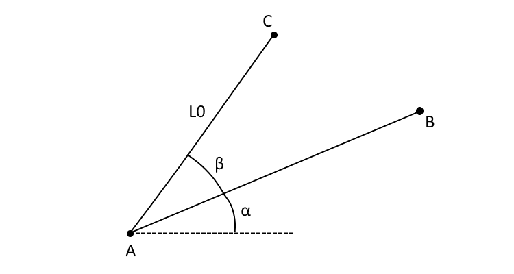
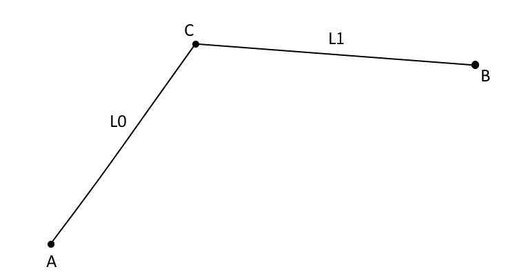
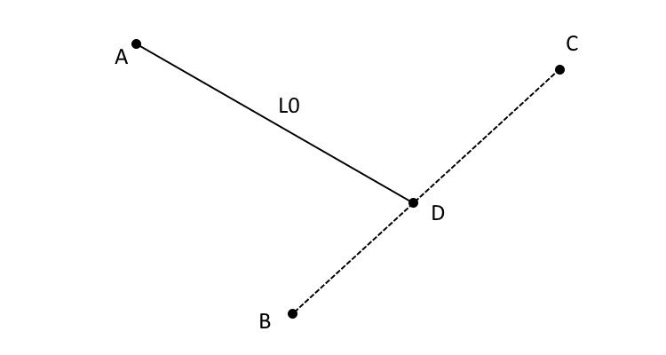
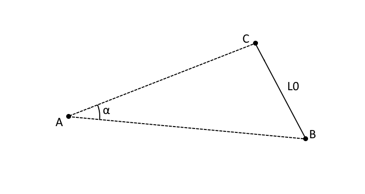
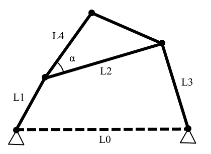

# Pyslvs API

## Module `pyslvs`

Kernel of Pyslvs.

### get_vlinks()

| vpoints | return |
|:-------:|:------:|
| Iterable\[VPoint] | List\[VLink] |

Get VLinks from a list of VPoint `vpoints`.

### VJoint

Inherited from `IntEnum`.

Is an enum class.

| R | P | RP |
|:---:|:---:|:---:|
| `1` | `2` | `3` |

Enumeration values of Joint types.

### VPoint

Inherited from `object`.

| links | c | type | color | color_str | type_str | x | y | angle | HOLDER |
|:-----:|:---:|:----:|:-----:|:---------:|:--------:|:---:|:---:|:-----:|:------:|
| Sequence\[str] | ndarray | VJoint | Optional\[Tuple\[int, int, int]] | str | str | float | float | float | ClassVar\[VPoint] |

Mechanism expression class.

#### VPoint.\_\_init__()

| self | links | type_int | angle | color_str | x | y | color_func | return |
|:----:|:-----:|:--------:|:-----:|:---------:|:---:|:---:|:----------:|:------:|
|   | Iterable\[str] | VJoint | float | str | float | float | Optional\[Callable\[\[str], Tuple\[int, int, int]]] | Any |
|   |   |   |   |   |   |   | None |   |

The attributes will match to the object attributes of [VPoint] objects.

Where the color function `color_func` needs to transform the color string `color_str` into RGB format.
If color information is not needed, the `color_func` can be `None`.

!!! note
    Some of the attributes are not work in some of the joint types.

#### VPoint.copy()

| self | return |
|:----:|:------:|
|   | VPoint |

The copy method of the VPoint object.

#### VPoint.cx

Is a property.

X value of current coordinate.
If it's slider, the pin coordinate will be returned.

#### VPoint.cy

Is a property.

Y value of current coordinate.
If it's slider, the pin coordinate will be returned.

#### VPoint.disable_offset()

| self | return |
|:----:|:------:|
|   | None |

Disable offset setting of the joint.

#### VPoint.distance()

| self | p | return |
|:----:|:---:|:------:|
|   | VPoint | float |

Return the distance between two VPoint objects.

#### VPoint.expr()

| self | return |
|:----:|:------:|
|   | str |

Return the literal mechanism expression of the joint.

#### VPoint.grounded()

| self | return |
|:----:|:------:|
|   | bool |

Return true if the joint pin is connected to ground link.

#### VPoint.has_offset()

| self | return |
|:----:|:------:|
|   | bool |

Return true if the offset setting is enabled.

#### VPoint.is_slider()

| self | return |
|:----:|:------:|
|   | bool |

Return true for slider type.

#### VPoint.is\_slot_link()

| self | link | return |
|:----:|:----:|:------:|
|   | str | bool |

Return true if the slot is on the link `link_name`.

#### VPoint.link_pos()

| self | link | return |
|:----:|:----:|:------:|
|   | str | Coord |

Return the position for the vlink.

#### VPoint.locate()

| self | x | y | return |
|:----:|:---:|:---:|:------:|
|   | float | float | None |

The update function of original coordinate.

#### VPoint.move()

| self | c1 | c2 | return |
|:----:|:---:|:---:|:------:|
|   | Tuple\[float, float] | Optional\[Tuple\[float, float]] | None |
|   |   | None |   |

The update function of current coordinate(s).
The 2nd placement is the pin coordinate of slider joints.

If there is only one argument for a slider joint,
the slot and pin coordinates will be set to the same position.

#### VPoint.no_link()

| self | return |
|:----:|:------:|
|   | bool |

Return true if there is no any link in links attribute.

#### VPoint.offset()

| self | return |
|:----:|:------:|
|   | float |

Return the offset constraint value of the joint.

#### VPoint.pin_grounded()

| self | return |
|:----:|:------:|
|   | bool |

Return true if the point is at the same link.

#### VPoint.r_joint()

| links | x | y | return |
|:-----:|:---:|:---:|:------:|
| Iterable\[str] | float | float | VPoint |

Is a static method.

A fast constructor of revolute joints.

#### VPoint.replace_link()

| self | link1 | link2 | return |
|:----:|:-----:|:-----:|:------:|
|   | str | str | None |

Replace the value in links attribute.

#### VPoint.rotate()

| self | angle | return |
|:----:|:-----:|:------:|
|   | float | None |

The update function of angle attribute.

#### VPoint.same_link()

| self | p | return |
|:----:|:---:|:------:|
|   | VPoint | bool |

Return true if the point is at the same link.

#### VPoint.set_links()

| self | links | return |
|:----:|:-----:|:------:|
|   | Iterable\[str] | None |

The update function of links attribute.

#### VPoint.set_offset()

| self | offset | return |
|:----:|:------:|:------:|
|   | float | None |

The update function of slider offset.
It will also enable offset value after called.

#### VPoint.slider_joint()

| links | type_int | angle | x | y | return |
|:-----:|:--------:|:-----:|:---:|:---:|:------:|
| Iterable\[str] | VJoint | float | float | float | VPoint |

Is a static method.

A fast constructor of slider joints.

#### VPoint.slope_angle()

| self | p | num1 | num2 | return |
|:----:|:---:|:----:|:----:|:------:|
|   | VPoint | int | int | float |
|   |   | 2 | 2 |   |

Return the value `hypot(p_x - m_x, p_y - m_y)`,
where `m_x`, `m_y` is the value of the joint,
and `p_x`, `p_y` is the value of `p`.

The option `num1` and `num2` is the position of current coordinate
attribute.

#### VPoint.sx

Is a property.

X value of slot coordinate.

#### VPoint.sy

Is a property.

Y value of slot coordinate.

#### VPoint.to_coord()

| self | ind | return |
|:----:|:---:|:------:|
|   | int | Coord |

Obtain coordinate by Coord object.

#### VPoint.true_offset()

| self | return |
|:----:|:------:|
|   | float |

Return the current offset value of the joint.

### VLink

Inherited from `object`.

| name | color_str | color | points | HOLDER | FRAME |
|:----:|:---------:|:-----:|:------:|:------:|:-----:|
| str | str | Optional\[Tuple\[int, int, int]] | Sequence\[int] | ClassVar\[VLink] | ClassVar\[str] |

Mechanism expression class in link's view.

#### VLink.\_\_init__()

| self | name | color_str | points | color_func | return |
|:----:|:----:|:---------:|:------:|:----------:|:------:|
|   | str | str | Iterable\[int] | Optional\[Callable\[\[str], Tuple\[int, int, int]]] | Any |
|   |   |   |   | None |   |

The attributes will match to the object attributes of [VLink] objects.

Where the color function `color_func` needs to transform the color string `color_str` into RGB format.
If color information is not needed, the `color_func` can be `None`.

#### VLink.points_pos()

| self | vpoints | return |
|:----:|:-------:|:------:|
|   | Iterable\[VPoint] | Sequence\[Coord] |

Get link positions from a VPoint list.

#### VLink.set_points()

| self | points | return |
|:----:|:------:|:------:|
|   | Iterable\[int] | None |

The update function of points attribute.

### Coord

Inherited from `object`.

| x | y |
|:---:|:---:|
| float | float |

A data class used to store coordinates.

#### Coord.\_\_init__()

| self | x | y | return |
|:----:|:---:|:---:|:------:|
|   | float | float | Any |

The constructor of Coordinate class.

#### Coord.distance()

| self | p | return |
|:----:|:---:|:------:|
|   | Coord | float |

Return the distance between two coordinates.

#### Coord.is_nan()

| self | return |
|:----:|:------:|
|   | bool |

Return true if the coordinate value is not a number.

#### Coord.slope_angle()

| self | p | return |
|:----:|:---:|:------:|
|   | Coord | float |

Slope angle of two coordinates.

### SolverSystem

Inherited from `object`.

Sketch Solve solver.

!!! note
    The object attributes of such type are unable to access.

#### SolverSystem.\_\_init__()

| self | vpoints | inputs | data_dict | return |
|:----:|:-------:|:------:|:---------:|:------:|
|   | Sequence\[VPoint] | Optional\[Mapping\[Tuple\[int, int], float]] | Optional\[Mapping\[Union\[int, Tuple\[int, int]], Union\[Coord, float]]] | Any |
|   |   | None | None |   |

The expression `vpoints` solver function of BFGS method by giving
the input pairs `inputs` and link length `data_dict` requirements.

!!! note
    The format of input pairs:

    + Revolut joints: `{(base, driver): angle}`
    + Slider joints: `{(base, base): offset}`

The format of `data_dict`:

+ Specific coordinates: Dict\[int, List\[Coord]]
+ Specific link length: Dict\[Tuple\[int, int], float]

The `data_dict` parameter will reformat its keys into `frozenset` type.

#### SolverSystem.same_points()

| self | vpoints_ | return |
|:----:|:--------:|:------:|
|   | Sequence\[VPoint] | bool |

Return true if two expressions are same.

#### SolverSystem.set_data()

| self | data_dict | return |
|:----:|:---------:|:------:|
|   | Union\[Mapping\[Tuple\[int, int], float], Mapping\[int, Coord]] | None |

Set the values of `data_dict` parameter from original constructor.
Two groups of `dict` keys must be the same or subset.

#### SolverSystem.set_inputs()

| self | inputs | return |
|:----:|:------:|:------:|
|   | Mapping\[Tuple\[int, int], float] | None |

Set the values of `inputs` parameter from original constructor.
Two groups of `dict` keys must be the same or subset.

#### SolverSystem.show_data()

| self | return |
|:----:|:------:|
|   | FrozenSet\[Union\[int, Tuple\[int, int]]] |

Show the current keys of `data_dict` parameter from original
constructor.

#### SolverSystem.show_inputs()

| self | return |
|:----:|:------:|
|   | FrozenSet\[Tuple\[int, int]] |

Show the current input pairs keys from original constructor.

#### SolverSystem.solve()

| self | return |
|:----:|:------:|
|   | List\[Union\[Tuple\[float, float], Tuple\[Tuple\[float, float], Tuple\[float, float]]]] |

Solve the conditions and return the result, raise ValueError if
not succeeded.
The joint position will returned by its index correspondingly.

+ Revolute joints: Tuple[float, float]
+ Slider joints: Tuple[Tuple[float, float], Tuple[float, float]]

### t_config()

| vpoints | inputs | status | return |
|:-------:|:------:|:------:|:------:|
| Sequence\[VPoint] | Sequence\[Tuple\[int, int]] | Optional\[Dict\[int, bool]] | EStack |
|   |   | None |   |

Generate the Triangle solution stack by mechanism expression `vpoints_`.

The argument `inputs` is a list of input pairs.
The argument `status` will track the configuration of each point,
which is optional.

### EStack

Inherited from `object`.

| well_done |
|:---------:|
| bool |

Triangle solution stack, generated from [`t_config`](#t_config).
It is pointless to call the constructor.

#### EStack.\_\_init__()

| self | **args | **kwargs | return |
|:----:|:------:|:--------:|:------:|
|   | Any | Any | Any |

Initialize self.  See help(type(self)) for accurate signature.

#### EStack.as_list()

| self | return |
|:----:|:------:|
|   | List\[Tuple\[str, ...]] |

Copy the dataset as list object.

### pxy()

| c1 | x | y | return |
|:---:|:---:|:---:|:------:|
| Coord | float | float | Coord |

The PXY function requires one point and offset values, get the
position of second point.

In the following picture, `c1` correspond to "A", `d0` correspond to "X",
`d1` correspond to "Y", `return` correspond to "B", the sign of value are
correspond to coordinate system.


### ppp()

| c1 | c2 | c3 | return |
|:---:|:---:|:---:|:------:|
| Coord | Coord | Coord | Coord |

The PPP function is used to solve parallel linkage.

In the following picture, `c1` correspond to "A", `c2` correspond to "B",
`c3` correspond to "C", `return` correspond to "D".


### plap()

| c1 | d0 | a0 | c2 | inverse | return |
|:---:|:---:|:---:|:---:|:-------:|:------:|
| Coord | float | float | Optional\[Coord] | bool | Coord |
|   |   |   | None | False |   |

The PLAP function requires two points, one distance and one angle,
obtained the position of third point. The unit of `a0` is degree.

In the following picture, `c1` correspond to "A", `c2` correspond to "B",
`d0` correspond to "L0", `a0` correspond to "beta", `return` correspond
to "C".
If `c2` is not given, "alpha" will be set to zero.



Set `inverse` option to `True` can make `a0` value as negative.

### pllp()

| c1 | d0 | d1 | c2 | inverse | return |
|:---:|:---:|:---:|:---:|:-------:|:------:|
| Coord | float | float | Coord | bool | Coord |
|   |   |   |   | False |   |

The PLLP function requires two points and two distances, obtained the
position of third point.

In the following picture, `c1` correspond to "A", `c2` correspond to "B",
`d0` correspond to "L0", `d1` correspond to "L1", `return` correspond to
"C".



Set `inverse` option to `True` can make the result upside down.

### plpp()

| c1 | d0 | c2 | c3 | inverse | return |
|:---:|:---:|:---:|:---:|:-------:|:------:|
| Coord | float | Coord | Coord | bool | Coord |
|   |   |   |   | False |   |

The PLPP function requires three points and one distance, obtained the
position of fourth point.

In the following picture, `c1` correspond to "A", `c2` correspond to "B",
`c3` correspond to "C", `d0` correspond to "L0", `return` correspond to "D".



Set `inverse` option to `True` can make the result to the another side
between `c1` and line `c2` `c3`.

### palp()

| c1 | a0 | d0 | c2 | inverse | return |
|:---:|:---:|:---:|:---:|:-------:|:------:|
| Coord | float | float | Coord | bool | Coord |
|   |   |   |   | False |   |

The PALP function requires two points, one angle and one distance,
obtained the position of fourth point.

In the following picture, `c1` correspond to "A", `c2` correspond to "B",
`d0` correspond to "L0", `a0` correspond to "alpha", `return` correspond
to "C".



Set `inverse` option to `True` can make the result upside down.

### vpoint_dof()

| vpoints | return |
|:-------:|:------:|
| Sequence\[VPoint] | int |

Return the DOF of the mechanism expression `vpoints`.

### expr_solving()

| exprs | vpoints | angles | return |
|:-----:|:-------:|:------:|:------:|
| EStack | Sequence\[VPoint] | Optional\[Mapping\[Tuple\[int, int], float]] | List\[Union\[Tuple\[float, float], Tuple\[Tuple\[float, float], Tuple\[float, float]]]] |
|   |   | None |   |

Solver function of Triangular method and BFGS method, for mechanism
expression `vpoints`.

The triangle expression stack `expr` is generated from
[`t_config`](#t_config).

Solver function will not handle slider input pairs in argument `angles`,
which is only support revolute joints. In another way, the slider input
pairs can be set by [`VPoint.disable_offset()`](#vpointdisable_offset)
method.

### uniform_path()

| dimension | n | return |
|:---------:|:---:|:------:|
| ndarray | int | ndarray |

Generate path with four-bar dimensions.

Normalized parameters are $[L_0, L_2, L_3, L_4, lpha]$.

### uniform\_four_bar()

| ml | n | return |
|:---:|:---:|:------:|
| float | int | ndarray |

Generate n four bar mechanisms from maximum lengths.

These mechanisms have coupling points.
Normalized parameters are $[L_0, L_2, L_3, L_4, lpha]$.



### FMatch

Inherited from `ObjFunc`.

This class is used to verified kinematics of the linkage mechanism.

A fast matching method that adds mapping angles to variables.

#### FMatch.\_\_init__()

| self | mech | return |
|:----:|:----:|:------:|
|   | Dict\[str, Any] | Any |

The constructor of objective object.

Options of `mech_params`:

+ `Expression`: The mechanism expression of the structure.
    + type: List\[[VPoint]]
+ `input`: Input pairs.
    + type: List[Tuple[int, int]]
+ `Placement`: The grounded joints setting. (`x`, `y`, `r`)
    + type: Dict[int, Tuple[float, float, float]]
+ `Target`: The target path.
    + type: Dict[int, Sequence[Tuple[float, float]]]
+ `same`: Multiple joint setting. The joints are according to [`edges_view`](#edges_view).
    + type: Dict[int, int]
+ `upper`: The upper setting of variables, the length must same as variable array.
    + type: List[float]
+ `lower`: The lower setting of variables, the length must same as variable array.
    + type: List[float]
+ `shape_only`: Compare paths by shape only.
    + type: bool

Variable array:

| | Placement | Link length | Inputs |
|:---:|:-----:|:-----------:|:------:|
| `v =` | `x0`, `y0`, ... | `l0`, `l1`, ... | `a00`, `a01`, ..., `a10`, `a11`, ... |

In 1D array: `v = [x0, y0, ..., l0, l1, ..., a00, a01, ..., a10, a11, ...]`

#### FMatch.fitness()

| self | v | return |
|:----:|:---:|:------:|
|   | ndarray | float64 |

The fitness is the error between target path and self.

Chromosome format: (decided by upper and lower)

v: `[Ax, Ay, Dx, Dy, ..., L0, L1, ..., A00, A01, ..., A10, A11, ...]`

#### FMatch.is\_two_kernel()

| self | return |
|:----:|:------:|
|   | bool |

Input a generic data (variable array), return the mechanism
expression.

#### FMatch.result()

| self | v | return |
|:----:|:---:|:------:|
|   | ndarray | str |

Input a generic data (variable array), return the mechanism
expression.

### norm_path()

| path | scale | return |
|:----:|:-----:|:------:|
| Iterable\[Tuple\[float, float]] | float | List\[Tuple\[float, float]] |
|   | 1 |   |

Python wrapper of normalization function.

### curvature()

| path | return |
|:----:|:------:|
| Iterable\[Tuple\[float, float]] | ndarray |

Calculate the signed curvature and return as an array.

$$
\kappa(t) = \frac{x'y'' - x''y'}{(x'^2 + y'^2)^\frac{3}{2}}
$$

### derivative()

| path | return |
|:----:|:------:|
| ndarray | ndarray |

Differential function. Return $p'$.

### path_signature()

| k | maximum | return |
|:---:|:-------:|:------:|
| ndarray | float | ndarray |
|   | 100 |   |

Require a curvature, return path signature.
It's composed by curvature $\kappa$ and a $K$ value.

$$
K = \int^t_0 |\kappa(t)| dt
$$

```python
path_signature(curvature(...))
```

### cross_correlation()

| p1 | p2 | t | return |
|:---:|:---:|:---:|:------:|
| ndarray | ndarray | float | ndarray |
|   |   | 0.1 |   |

Compare signature and return as an 1d array.

$$
\begin{aligned}
C_n(j, W, P) &= \left|\sum_i^{l_P} \frac{(W_{i + j}
- \overline{W}_{j\rightarrow j + l_P})(P_i-\overline{P})}{
\sqrt{\sum_i^{l_P}(W_{i + j} - \overline{W}_{j\rightarrow j + l_P})^2
\sum_i^{l_P}(P_i - \overline{P})^2}}\right|
\\
S &= \arg\max\{C_n(j)\} t
\end{aligned}
$$

```python
ps1 = path_signature(curvature(...))
ps2 = path_signature(curvature(...))
cc = cross_correlation(ps1, ps2)
```

### color_rgb()

| name | return |
|:----:|:------:|
| str | Tuple\[int, int, int] |

Get color by name.

Get RGB color data by name, return `(0, 0, 0)` if it is invalid.
Also support `"(R, G, B)"` string format.

### parse_params()

| expr | return |
|:----:|:------:|
| str | List\[expression\_parser.PointArgs] |

Parse mechanism expression into VPoint constructor arguments.

### parse_pos()

| expr | return |
|:----:|:------:|
| str | List\[Tuple\[float, float]] |

Parse mechanism expression into coordinates.

### parse_vpoints()

| expr | return |
|:----:|:------:|
| str | List\[VPoint] |

Parse mechanism expression into VPoint objects.

### parse_vlinks()

| expr | return |
|:----:|:------:|
| str | List\[VLink] |

Parse mechanism expression into VLink objects.

### edges_view()

| graph | return |
|:-----:|:------:|
| Graph | Iterator\[Tuple\[int, Tuple\[int, int]]] |

The iterator will yield the sorted edges from `graph`.

### graph2vpoints()

| graph | pos | cus | same | grounded | return |
|:-----:|:---:|:---:|:----:|:--------:|:------:|
| Graph | Dict\[int, Tuple\[float, float]] | Optional\[Dict\[int, int]] | Optional\[Dict\[int, int]] | Optional\[int] | List\[VPoint] |
|   |   | None | None | None |   |

Transform `graph` into [VPoint] objects. The vertices are mapped to links.

+ `pos`: Position for each vertices.
+ `cus`: Extra points on the specific links.
+ `same`: Multiple joint setting. The joints are according to [`edges_view`](#edges_view).
+ `grounded`: The ground link of vertices.

### PointArgs

Inherited from `object`.

Is a data class.

| links | type | color | x | y |
|:-----:|:----:|:-----:|:---:|:---:|
| str | str | str | float | float |

Point table argument.

### LinkArgs

Inherited from `object`.

Is a data class.

| name | color | points |
|:----:|:-----:|:------:|
| str | str | str |

Link table argument.

### example_list()

| key | return |
|:---:|:------:|
| str | Tuple\[str, Sequence\[Tuple\[int, int]]] |

The example data of mechanisms.

The format of each mechanism is:

+ `[0]`: Mechanism expression.
    + type: str
+ `[1]`: Input pairs.
    + type: Tuple[Tuple[int, int], ...]]

### all_examples()

| return |
|:------:|
| Iterator\[str] |

Get all example names.

### collection_list()

| key | return |
|:---:|:------:|
| str | Mapping\[str, Any] |

The example data of collections.

The format of each configuration is:

+ `Expression`: Mechanism expression of the structure.
    + type: str
+ `input`: Input pairs.
    + type: Sequence[Tuple[int, int]]
+ `Graph`: The generalized chain graph in edge set.
    + type: Sequence[Tuple[int, int]]
+ `Placement`: The grounded joints setting. (`x`, `y`, `r`)
    + type: Dict[int, Optional[Tuple[float, float, float]]]
+ `Target`: The target joints settings.
    + type: Dict[int, Optional[Sequence[Tuple[float, float]]]]
+ `cus`: The custom joints on specific link. (link number correspond to
    the graph expression.)
    + type: Dict[int, int]
+ `same`: The multiple joints setting.
    + type: Dict[int, int]

### all_collections()

| return |
|:------:|
| Iterator\[str] |

Get all collection names.

### efd_fitting()

| path | n | return |
|:----:|:---:|:------:|
| Sequence\[Tuple\[float, float]] | int | ndarray |
|   | 0 |   |

Curve fitting using Elliptical Fourier Descriptor.

The path `path` will be translated to Fourier descriptor coefficients,
then regenerate a new path as a `n` x 4 NumPy array.

### Coordinate

Alias to [Coord].

A data class used to store coordinates.

### get_include()

| return |
|:------:|
| str |

Get include directory.

## Module `pyslvs.graph`

Pyslvs graph functions.

### link_assortment()

| g | return |
|:---:|:------:|
| Graph | List\[int] |

Return link assortment of the graph.

### contracted\_link_assortment()

| g | return |
|:---:|:------:|
| Graph | List\[int] |

Return contracted link assortment of the graph.

### labeled_enumerate()

| g | return |
|:---:|:------:|
| Graph | List\[Tuple\[int, Graph]] |

Enumerate each node with labeled except isomorphism.

### Graph

Inherited from `object`.

| edges | vertices |
|:-----:|:--------:|
| Tuple\[Tuple\[int, int], ...] | Tuple\[int, ...] |

The undirected graph class, support multigraph.

#### Graph.\_\_init__()

| self | edges | return |
|:----:|:-----:|:------:|
|   | Iterable\[Tuple\[int, int]] | Any |

Input edges of the graph. The vertices symbols are
positive continuously integer.

#### Graph.add_edge()

| self | n1 | n2 | return |
|:----:|:---:|:---:|:------:|
|   | int | int | None |

Add edge `n1` to `n2`.

#### Graph.add_vertices()

| self | vertices | return |
|:----:|:--------:|:------:|
|   | Iterable\[int] | None |

Add vertices from iterable object `vertices`.

#### Graph.adjacency_matrix()

| self | return |
|:----:|:------:|
|   | ndarray |

Generate a adjacency matrix.

Assume the matrix $A[i, j] = A[j, i]$.
Where $A[i, j] = 1$ if edge `(i, j)` exist.

#### Graph.copy()

| self | return |
|:----:|:------:|
|   | Graph |

The copy method of the Graph object.

#### Graph.degree_code()

| self | return |
|:----:|:------:|
|   | int |

Generate a degree code.

With a sorted vertices mapping by the degrees of each vertex,
regenerate a new adjacency matrix.
A binary code can be found by concatenating the upper right elements.
The degree code is the maximum value of the permutation.

#### Graph.degrees()

| self | return |
|:----:|:------:|
|   | Dict\[int, int] |

Return the degrees of each vertex.

#### Graph.dof()

| self | return |
|:----:|:------:|
|   | int |

Return DOF of the graph.

!!! note
    DOF is the Degree of Freedoms to a mechanism.

    In the [Graph] objects, all vertices will assumed as revolute
    joints (1 DOF).

    $$
    F = 3(N_L - 1) - 2N_J
    $$

#### Graph.duplicate()

| self | vertices | times | return |
|:----:|:--------:|:-----:|:------:|
|   | Iterable\[int] | int | Graph |

Make graph duplicate by specific `vertices`. Return a new graph.

#### Graph.has\_cut_link()

| self | return |
|:----:|:------:|
|   | bool |

Return true if the graph has any cut links.

#### Graph.has_triangle()

| self | return |
|:----:|:------:|
|   | bool |

Return true if the graph has triangle.

#### Graph.is_connected()

| self | without | return |
|:----:|:-------:|:------:|
|   | int | bool |
|   | -1 |   |

Return `True` if the graph is connected.
Set the argument `without` to ignore one vertex.

#### Graph.is_degenerate()

| self | return |
|:----:|:------:|
|   | bool |

Return true if this kinematic chain is degenerate.

+ Prue all multiple contracted links recursively.
+ Check the DOF of sub-graph if it is lower then zero.

#### Graph.is_isomorphic()

| self | graph | return |
|:----:|:-----:|:------:|
|   | Graph | bool |

Return true if two graphs is isomorphic.

Default is using VF2 algorithm.

#### Graph.is\_isomorphic\_degree_code()

| self | graph | return |
|:----:|:-----:|:------:|
|   | Graph | bool |

Compare isomorphism by degree code algorithm.

+ <https://doi.org/10.1115/1.2919236>

#### Graph.is\_isomorphic_vf2()

| self | graph | return |
|:----:|:-----:|:------:|
|   | Graph | bool |

Compare isomorphism by VF2 algorithm,
one of the high performance isomorphic algorithms.

#### Graph.neighbors()

| self | n | return |
|:----:|:---:|:------:|
|   | int | Tuple\[int, ...] |

Return the neighbors of the vertex `n`.

### is_planar()

| g | return |
|:---:|:------:|
| Graph | bool |

Return true if the graph is a planar graph.

### external\_loop_layout()

| graph | node_mode | scale | return |
|:-----:|:---------:|:-----:|:------:|
| Graph | bool | float | Dict\[int, Tuple\[float, float]] |
|   |   | 1.0 |   |

Layout position decided by outer loop (max cycle).

Return the layout position decided by external loop.
Argument `node_mode` will transform edges into vertices.
Argument `scale` will resize the position by scale factor.

### conventional_graph()

| cg_list | c\_j_list | no_degenerate | stop_func | return |
|:-------:|:--------:|:-------------:|:---------:|:------:|
| List\[Graph] | Sequence\[int] | int | Optional[Callable[[], bool]] | List\[Graph] |
|   |   | 1 | None |   |

Generate conventional graphs by contracted graphs `cg_list` and
contracted link assortment `c_j_list`.

The degenerate setting `no_degenerate` has following option:

+ `0`: No degenerate.
+ `1`: Only degenerate.
+ Else: All graphs.

The check stop function `stop_func` object for GUI or subprocess,
return `True` to terminate this function.

### contracted_graph()

| link_num | stop_func | return |
|:--------:|:---------:|:------:|
| Sequence\[int] | Optional[Callable[[], bool]] | List\[Graph] |
|   | None |   |

Generate contracted graphs by link assortment `link_num`.

The check stop function `stop_func` object for GUI or subprocess,
return `True` to terminate this function.

### link_synthesis()

| nl | nj | stop_func | return |
|:---:|:---:|:---------:|:------:|
| int | int | Optional[Callable[[], bool]] | List\[Tuple\[int, ...]] |
|   |   | None |   |

Return link assortment by number of links `nl` and number of joints `nj`.

The check stop function `stop_func` object for GUI or subprocess,
return `True` to terminate this function.

### contracted\_link_synthesis()

| link\_num_list | stop_func | return |
|:-------------:|:---------:|:------:|
| Sequence\[int] | Optional[Callable[[], bool]] | List\[Tuple\[int, ...]] |
|   | None |   |

Return contracted link assortment by link assortment `link_num_list`.

The check stop function `stop_func` object for GUI or subprocess,
return `True` to terminate this function.

## Module `pyslvs.metaheuristics`

Kernel of Metaheuristic Algorithm.

### ObjFunc

Inherited from `Generic`. Parameters: `~FVal`

Objective function base class.

It is used to build the objective function for Meta-heuristic Algorithms.

#### ObjFunc.\_\_init__()

| self | **args | **kwargs | return |
|:----:|:------:|:--------:|:------:|
|   | Any | Any | Any |

Initialize self.  See help(type(self)) for accurate signature.

#### ObjFunc.fitness()

| self | v | return |
|:----:|:---:|:------:|
|   | ndarray | float64 |

Is an abstract method.

(`cdef` function) Return the fitness from the variable list `v`.
This function will be directly called in the algorithms.

#### ObjFunc.result()

| self | v | return |
|:----:|:---:|:------:|
|   | ndarray | FVal |

Is an abstract method.

Return the result from the variable list `v`.

### Algorithm

Inherited from `Generic`. Parameters: `~FVal`

| func |
|:----:|
| ObjFunc\[~FVal] |

Algorithm base class.

It is used to build the Meta-heuristic Algorithms.

#### Algorithm.\_\_init__()

| self | func | settings | progress_fun | interrupt_fun | return |
|:----:|:----:|:--------:|:------------:|:-------------:|:------:|
|   | ObjFunc\[~FVal] | Dict\[str, Any] | Optional\[Callable\[\[int, str], None]] | Optional[Callable[[], bool]] | Any |
|   |   |   | None | None |   |

Is an abstract method.

The argument `func` is an object inherit from [ObjFunc],
and all abstract methods should be implemented.

The format of argument `settings` can be customized.

The argument `progress_fun` will be called when update progress,
and the argument `interrupt_fun` will check the interrupt status from GUI or subprocess.

#### Algorithm.history()

| self | return |
|:----:|:------:|
|   | Sequence\[Tuple\[int, float, float]] |

Return the history of the process.

The first value is generation (iteration);
the second value is fitness;
the third value is time in second.

#### Algorithm.run()

| self | return |
|:----:|:------:|
|   | FVal |

Run and return the result and convergence history.

The first place of `return` is came from
calling [`ObjFunc.result()`](#objfuncresult).

The second place of `return` is a list of generation data,
which type is `Tuple[int, float, float]]`.
The first of them is generation,
the second is fitness, and the last one is time in second.

### Genetic

Inherited from `Algorithm`.

| func |
|:----:|
| ObjFunc\[~FVal] |

The implementation of Real-coded Genetic Algorithm.

#### Genetic.\_\_init__()

| self | func | settings | progress_fun | interrupt_fun | return |
|:----:|:----:|:--------:|:------------:|:-------------:|:------:|
|   | ObjFunc\[~FVal] | Dict\[str, Any] | Optional\[Callable\[\[int, str], None]] | Optional[Callable[[], bool]] | Any |
|   |   |   | None | None |   |

The format of argument `settings`:

+ `nPop`: Population
    + type: int
    + default: 500
+ `pCross`: Crossover rate
    + type: float (0.~1.)
    + default: 0.95
+ `pMute`: Mutation rate
    + type: float (0.~1.)
    + default: 0.05
+ `pWin`: Win rate
    + type: float (0.~1.)
    + default: 0.95
+ `bDelta`: Delta value
    + type: float
    + default: 5.
+ `max_gen` or `min_fit` or `max_time`: Limitation of termination
    + type: int / float / float
    + default: Raise `ValueError`
+ `report`: Report per generation
    + type: int
    + default: 10

Others arguments are same as [`Differential.__init__()`](#differential9595init__).

#### Genetic.history()

| self | return |
|:----:|:------:|
|   | Sequence\[Tuple\[int, float, float]] |

Is a static method.

Return the history of the process.

The first value is generation (iteration);
the second value is fitness;
the third value is time in second.

#### Genetic.run()

| self | return |
|:----:|:------:|
|   | FVal |

Is a static method.

Run and return the result and convergence history.

The first place of `return` is came from
calling [`ObjFunc.result()`](#objfuncresult).

The second place of `return` is a list of generation data,
which type is `Tuple[int, float, float]]`.
The first of them is generation,
the second is fitness, and the last one is time in second.

### Firefly

Inherited from `Algorithm`.

| func |
|:----:|
| ObjFunc\[~FVal] |

The implementation of Firefly Algorithm.

#### Firefly.\_\_init__()

| self | func | settings | progress_fun | interrupt_fun | return |
|:----:|:----:|:--------:|:------------:|:-------------:|:------:|
|   | ObjFunc\[~FVal] | Dict\[str, Any] | Optional\[Callable\[\[int, str], None]] | Optional[Callable[[], bool]] | Any |
|   |   |   | None | None |   |

The format of argument `settings`:

+ `n`: Population
    + type: int
    + default: 80
+ `alpha`: Alpha factor
    + type: float (0.~1.)
    + default: 0.01
+ `beta_min`: Minimal attraction
    + type: float (0.~1.)
    + default: 0.2
+ `beta0`: Attraction rate
    + type: float (0.~1.)
    + default: 1.
+ `gamma`: Gamma rate
    + type: float (0.~1.)
    + default: 1.
+ `max_gen` or `min_fit` or `max_time`: Limitation of termination
    + type: int / float / float
    + default: Raise `ValueError`
+ `report`: Report per generation
    + type: int
    + default: 10

Others arguments are same as [`Differential.__init__()`](#differential9595init__).

#### Firefly.history()

| self | return |
|:----:|:------:|
|   | Sequence\[Tuple\[int, float, float]] |

Is a static method.

Return the history of the process.

The first value is generation (iteration);
the second value is fitness;
the third value is time in second.

#### Firefly.run()

| self | return |
|:----:|:------:|
|   | FVal |

Is a static method.

Run and return the result and convergence history.

The first place of `return` is came from
calling [`ObjFunc.result()`](#objfuncresult).

The second place of `return` is a list of generation data,
which type is `Tuple[int, float, float]]`.
The first of them is generation,
the second is fitness, and the last one is time in second.

### Differential

Inherited from `Algorithm`.

| func |
|:----:|
| ObjFunc\[~FVal] |

The implementation of Differential Evolution.

#### Differential.\_\_init__()

| self | func | settings | progress_fun | interrupt_fun | return |
|:----:|:----:|:--------:|:------------:|:-------------:|:------:|
|   | ObjFunc\[~FVal] | Dict\[str, Any] | Optional\[Callable\[\[int, str], None]] | Optional[Callable[[], bool]] | Any |
|   |   |   | None | None |   |

The argument `func` is a object inherit from [Verification],
and all abstract methods should be implemented.

The format of argument `settings`:

+ `strategy`: Strategy
    + type: int (0~9)
    + default: 0
+ `NP`: Population
    + type: int
    + default: 400
+ `F`: Weight factor
    + type: float (0.~1.)
    + default: 0.6
+ `CR`: Crossover rate
    + type: float (0.~1.)
    + default: 0.9
+ `max_gen` or `min_fit` or `max_time` or `slow_down`: Limitation of termination
    + type: int / float / float / float
    + default: Raise `ValueError`
+ `report`: Report per generation
    + type: int
    + default: 10

!!! note
    The option `slow_down` is a percent value that
    current fitness difference of two generation is divide by last one.

The argument `progress_fun` will be called when update progress,
and the argument `interrupt_fun` will check the interrupt status from GUI or subprocess.

#### Differential.history()

| self | return |
|:----:|:------:|
|   | Sequence\[Tuple\[int, float, float]] |

Is a static method.

Return the history of the process.

The first value is generation (iteration);
the second value is fitness;
the third value is time in second.

#### Differential.run()

| self | return |
|:----:|:------:|
|   | FVal |

Is a static method.

Run and return the result and convergence history.

The first place of `return` is came from
calling [`ObjFunc.result()`](#objfuncresult).

The second place of `return` is a list of generation data,
which type is `Tuple[int, float, float]]`.
The first of them is generation,
the second is fitness, and the last one is time in second.

### TeachingLearning

Inherited from `Algorithm`.

| func |
|:----:|
| ObjFunc\[~FVal] |

The implementation of Teaching Learning Based Optimization.

#### TeachingLearning.\_\_init__()

| self | func | settings | progress_fun | interrupt_fun | return |
|:----:|:----:|:--------:|:------------:|:-------------:|:------:|
|   | ObjFunc\[~FVal] | Dict\[str, Any] | Optional\[Callable\[\[int, str], None]] | Optional[Callable[[], bool]] | Any |
|   |   |   | None | None |   |

The format of argument `settings`:

+ `class_size`: The number of students per class
    + type: int
    + default: 50
+ `max_gen` or `min_fit` or `max_time`: Limitation of termination
    + type: int / float / float
    + default: Raise `ValueError`
+ `report`: Report per generation
    + type: int
    + default: 10

Others arguments are same as [`Differential.__init__()`](#differential9595init__).

#### TeachingLearning.history()

| self | return |
|:----:|:------:|
|   | Sequence\[Tuple\[int, float, float]] |

Is a static method.

Return the history of the process.

The first value is generation (iteration);
the second value is fitness;
the third value is time in second.

#### TeachingLearning.run()

| self | return |
|:----:|:------:|
|   | FVal |

Is a static method.

Run and return the result and convergence history.

The first place of `return` is came from
calling [`ObjFunc.result()`](#objfuncresult).

The second place of `return` is a list of generation data,
which type is `Tuple[int, float, float]]`.
The first of them is generation,
the second is fitness, and the last one is time in second.

### AlgorithmType

Inherited from `str`.

Is an enum class.

| RGA | Firefly | DE | TLBO |
|:---:|:-------:|:---:|:----:|
| `'Real-coded Genetic Algorithm'` | `'Firefly Algorithm'` | `'Differential Evolution'` | `'Teaching Learning Based Optimization'` |

Enum type of algorithms.

[VPoint]: #vpoint
[VLink]: #vlink
[Coord]: #coord
[pxy]: #pxy
[ppp]: #ppp
[plap]: #plap
[pllp]: #pllp
[plpp]: #plpp
[palp]: #palp
[Graph]: #graph
[ObjFunc]: #objfunc
