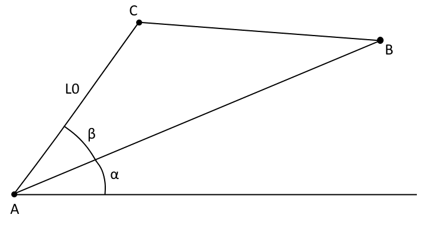
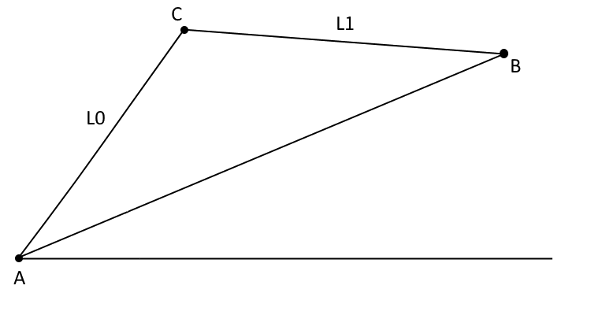
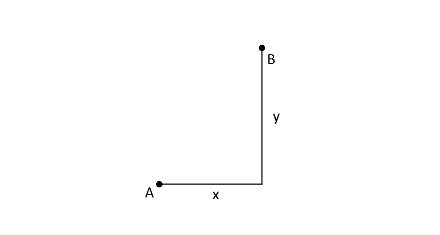

# Pyslvs API

## Module `pyslvs`

Kernel of Pyslvs.

### Coordinate

Inherited from `object`.

| x | y |
|:---:|:---:|
| float | float |

A data class used to store coordinates.

#### Coordinate.distance()

| self | p | return |
|:----:|:---:|:------:|
|   | Coordinate | float |

Return the distance between two coordinates.

#### Coordinate.is_nan()

| self | return |
|:----:|:------:|
|   | bool |

Return True if the coordinate value is not a number.

#### Coordinate.slope_angle()

| self | p | return |
|:----:|:---:|:------:|
|   | Coordinate | float |

Slope angle of two coordinates.

### plap()

| c1 | d0 | a0 | c2 | inverse | return |
|:---:|:---:|:---:|:---:|:-------:|:------:|
| Coordinate | float | float | Union\[Coordinate, None] | bool | Coordinate |
|   |   |   | None | False |   |

The PLAP function requires two points, one distance and one angle,
obtained the position of third point. The unit of `a0` is degree.

In the following picture, `c1` correspond to "A", `c2` correspond to "B",
`d0` correspond to "L0", `a0` correspond to "beta", `return` correspond
to "C".
If `c2` is not given, "alpha" will be set to zero.

Set `inverse` option to `True` can make `a0` value as negative.

### pllp()

| c1 | d0 | d1 | c2 | inverse | return |
|:---:|:---:|:---:|:---:|:-------:|:------:|
| Coordinate | float | float | Coordinate | bool | Coordinate |
|   |   |   |   | False |   |

The PLLP function requires two points and two distances, obtained the
position of third point.

In the following picture, `c1` correspond to "A", `c2` correspond to "B",
`d0` correspond to "L0", `d1` correspond to "L1", `return` correspond to
"C".

Set `inverse` option to `True` can make the result upside down.

### plpp()

| c1 | d0 | c2 | c3 | inverse | return |
|:---:|:---:|:---:|:---:|:-------:|:------:|
| Coordinate | float | Coordinate | Coordinate | bool | Coordinate |
|   |   |   |   | False |   |

The PLLP function requires three points and one distance, obtained the 
position of fourth point.

In the following picture, `c1` correspond to "A", `c2` correspond to "B",
`c3` correspond to "C", `d0` correspond to "L0", `return` correspond to "D".

Set `inverse` option to `True` can make the result to the another side
between `c1` and line `c2` `c3`.

### pxy()

| c1 | x | y | return |
|:---:|:---:|:---:|:------:|
| Coordinate | float | float | Coordinate |

The PXY function requires one point and offset values, obtained the 
position of second point.

In the following picture, `c1` correspond to "A", `d0` correspond to "X",
`d1` correspond to "Y", `return` correspond to "B", the sign of value are
correspond to coordinate system.

### expr_parser()

| exprs | data_dict | return |
|:-----:|:---------:|:------:|
| Sequence\[Tuple\[str, ...]] | Dict\[str, float] | None |

Solve and update information of the triangle expression `exprs` to 
`data_dict`.
The argument `exprs` can be obtained by
[`t_config`](#t_config) and [`EStack.as_list()`](#estackas_list) method.

This function is already included in [`expr_solving`](#expr_solving),
not recommended for direct use.

### expr_solving()

| exprs | mapping | vpoints | angles | return |
|:-----:|:-------:|:-------:|:------:|:------:|
| EStack | Dict\[Union\[int, Tuple\[int, int]], Union\[str, float]] | Sequence\[VPoint] | Union\[Sequence\[float], None] | List\[Union\[Tuple\[float, float], Tuple\[Tuple\[float, float], Tuple\[float, float]]]] |
|   |   |   | None |   |

Solver function of Triangular method and BFGS method, for mechanism 
expression `vpoints`.

The triangle expression stack `expr` is generated from
[`t_config`](#t_config).

The information data `mapping` map the symbols to the indicator of 
`vpoints`,
additionally has a same format as argument `data_dict` in [SolverSystem].

Solver function will not handle slider input pairs in argument `angles`,
which is only support revolute joints. In another way, the slider input 
pairs
can be set by [`VPoint.disable_offset()`](#vpointdisable_offset) method.

### data_collecting()

| exprs | mapping | vpoints_ | return |
|:-----:|:-------:|:--------:|:------:|
| EStack | Dict\[int, str] | Sequence\[VPoint] | Tuple\[Dict\[str, Union\[Coordinate, float]], int] |

Data transform function of Triangular method.
The triangle expression stack `expr` is generated from
[`t_config`](#t_config).
The information data `mapping` map the symbols to the indicator of 
`vpoints_`.

This function is already included in [`expr_solving`](#expr_solving),
not recommended for direct use.

### get_vlinks()

| vpoints | return |
|:-------:|:------:|
| Iterable\[VPoint] | List\[VLink] |

Get VLinks from a list of VPoint `vpoints`.

### VJoint

Inherited from `IntEnum`.

Is an enum class.

| R | P | RP |
|:---:|:---:|:---:|
| `1` | `2` | `3` |

Enumeration values of Joint types.

### VPoint

Inherited from `object`.

| links | c | type | color | color_str | type_str | x | y | angle | HOLDER |
|:-----:|:---:|:----:|:-----:|:---------:|:--------:|:---:|:---:|:-----:|:------:|
| Sequence\[str] | Tuple\[Tuple\[float, float], Tuple\[float, float]] | VJoint | Union\[Tuple\[int, int, int], None] | str | str | float | float | float | ClassVar\[VPoint] |

Mechanism expression class.

#### VPoint.copy()

| self | return |
|:----:|:------:|
|   | VPoint |

The copy method of the VPoint object.

#### VPoint.cx

Is a property.

X value of current coordinate.
If it's slider, the pin coordinate will be returned.

#### VPoint.cy

Is a property.

Y value of current coordinate.
If it's slider, the pin coordinate will be returned.

#### VPoint.disable_offset()

| self | return |
|:----:|:------:|
|   | None |

Disable offset setting of the joint.

#### VPoint.distance()

| self | p | return |
|:----:|:---:|:------:|
|   | VPoint | float |

Return the distance between two VPoint objects.

#### VPoint.expr()

| self | return |
|:----:|:------:|
|   | str |

Return the literal mechanism expression of the joint.

#### VPoint.grounded()

| self | return |
|:----:|:------:|
|   | bool |

Return True if the joint pin is connected to ground link.

#### VPoint.has_offset()

| self | return |
|:----:|:------:|
|   | bool |

Return True if the offset setting is enabled.

#### VPoint.is_slot_link()

| self | link_name | return |
|:----:|:---------:|:------:|
|   | str | bool |

Return True if the slot is on the link `link_name`.

#### VPoint.locate()

| self | x | y | return |
|:----:|:---:|:---:|:------:|
|   | float | float | None |

The update function of original coordinate.

#### VPoint.move()

| self | c1 | c2 | return |
|:----:|:---:|:---:|:------:|
|   | Tuple\[float, float] | Union\[Tuple\[float, float], None] | None |
|   |   | None |   |

The update function of current coordinate(s).
The 2nd placement is the pin coordinate of slider joints.

If there is only one argument for a slider joint,
the slot and pin coordinates will be set to the same position.

#### VPoint.no_link()

| self | return |
|:----:|:------:|
|   | bool |

Return True if there is no any link in links attribute.

#### VPoint.offset()

| self | return |
|:----:|:------:|
|   | float |

Return the offset constraint value of the joint.

#### VPoint.pin_grounded()

| self | return |
|:----:|:------:|
|   | bool |

Return True if the point is at the same link.

#### VPoint.r_joint()

| links | x | y | return |
|:-----:|:---:|:---:|:------:|
| Iterable\[str] | float | float | VPoint |

Is a static method.

A fast constructor of revolute joints.

#### VPoint.replace_link()

| self | link1 | link2 | return |
|:----:|:-----:|:-----:|:------:|
|   | str | str | None |

Replace the value in links attribute.

#### VPoint.rotate()

| self | angle | return |
|:----:|:-----:|:------:|
|   | float | None |

The update function of angle attribute.

#### VPoint.same_link()

| self | p | return |
|:----:|:---:|:------:|
|   | VPoint | bool |

Return True if the point is at the same link.

#### VPoint.set_links()

| self | links | return |
|:----:|:-----:|:------:|
|   | Iterable\[str] | None |

The update function of links attribute.

#### VPoint.set_offset()

| self | offset | return |
|:----:|:------:|:------:|
|   | float | None |

The update function of slider offset.
It will also enable offset value after called.

#### VPoint.slider_joint()

| links | type_int | angle | x | y | return |
|:-----:|:--------:|:-----:|:---:|:---:|:------:|
| Iterable\[str] | VJoint | float | float | float | VPoint |

Is a static method.

A fast constructor of slider joints.

#### VPoint.slope_angle()

| self | p | num1 | num2 | return |
|:----:|:---:|:----:|:----:|:------:|
|   | VPoint | int | int | float |
|   |   | 2 | 2 |   |

Return the value `hypot(p_x - m_x, p_y - m_y)`,
where `m_x`, `m_y` is the value of the joint,
and `p_x`, `p_y` is the value of `p`.

The option `num1` and `num2` is the position of current coordinate 
attribute.

#### VPoint.true_offset()

| self | return |
|:----:|:------:|
|   | float |

Return the current offset value of the joint.

### VLink

Inherited from `object`.

| name | color_str | color | points | HOLDER | FRAME |
|:----:|:---------:|:-----:|:------:|:------:|:-----:|
| str | str | Union\[Tuple\[int, int, int], None] | Sequence\[int] | ClassVar\[VLink] | ClassVar\[str] |

Mechanism expression class in link's view.

#### VLink.set_points()

| self | points | return |
|:----:|:------:|:------:|
|   | Iterable\[int] | None |

The update function of points attribute.

### SolverSystem

Inherited from `object`.

Sketch Solve solver.

!!! note
    The object attributes of such type are unable to access.

#### SolverSystem.same_points()

| self | vpoints_ | return |
|:----:|:--------:|:------:|
|   | Sequence\[VPoint] | bool |

Return True if two expressions are same.

#### SolverSystem.set_data()

| self | data_dict | return |
|:----:|:---------:|:------:|
|   | Union\[Dict\[Tuple\[int, int], float], Dict\[int, Coordinate]] | None |

Set the values of `data_dict` parameter from original constructor.
Two groups of `dict` keys must be the same or subset.

#### SolverSystem.set_inputs()

| self | inputs | return |
|:----:|:------:|:------:|
|   | Dict\[Tuple\[int, int], float] | None |

Set the values of `inputs` parameter from original constructor.
Two groups of `dict` keys must be the same or subset.

#### SolverSystem.show_data()

| self | return |
|:----:|:------:|
|   | FrozenSet\[Union\[int, Tuple\[int, int]]] |

Show the current keys of `data_dict` parameter from original
constructor.

#### SolverSystem.show_inputs()

| self | return |
|:----:|:------:|
|   | FrozenSet\[Tuple\[int, int]] |

Show the current input pairs keys from original constructor.

#### SolverSystem.solve()

| self | return |
|:----:|:------:|
|   | List\[Union\[Tuple\[float, float], Tuple\[Tuple\[float, float], Tuple\[float, float]]]] |

Solve the conditions and return the result, raise ValueError if
not succeeded.
The joint position will returned by its index correspondingly.

+ Revolute joints: Tuple[float, float]
+ Slider joints: Tuple[Tuple[float, float], Tuple[float, float]]

### norm_path()

| path | scale | return |
|:----:|:-----:|:------:|
| Iterable\[Tuple\[float, float]] | float | List\[Tuple\[float, float]] |
|   | 1 |   |

Python wrapper of normalization function.

### Planar

Inherited from `Objective`.

This class is used to verified kinematics of the linkage mechanism.

#### Planar.fitness()

| self | v | return |
|:----:|:---:|:------:|
|   | ndarray | float64 |

The fitness is the error between target path and self.

Chromosome format: (decided by upper and lower)

v: `[Ax, Ay, Dx, Dy, ..., L0, L1, ..., A00, A01, ..., A10, A11, ...]`

#### Planar.get_lower()

| self | return |
|:----:|:------:|
|   | ndarray |

Return lower bound.

#### Planar.get_upper()

| self | return |
|:----:|:------:|
|   | ndarray |

Return upper bound.

#### Planar.is_two_kernel()

| self | return |
|:----:|:------:|
|   | bool |

Input a generic data (variable array), return the mechanism 
expression.

#### Planar.result()

| self | v | return |
|:----:|:---:|:------:|
|   | ndarray | str |

Input a generic data (variable array), return the mechanism 
expression.

### t_config()

| vpoints_ | inputs | status | return |
|:--------:|:------:|:------:|:------:|
| Sequence\[VPoint] | Sequence\[Tuple\[int, int]] | Union\[Dict\[int, bool], None] | EStack |
|   |   | None |   |

Generate the Triangle solution stack by mechanism expression `vpoints_`.

The argument `inputs` is a list of input pairs.
The argument `status` will track the configuration of each point, 
which is optional.

### EStack

Inherited from `object`.

Triangle solution stack, generated from
[`t_config`](#t_config).
It is pointless to call the constructor.

#### EStack.as_list()

| self | return |
|:----:|:------:|
|   | List\[Tuple\[str, ...]] |

Copy the dataset as list object.

### vpoint_dof()

| vpoints | return |
|:-------:|:------:|
| Sequence\[VPoint] | int |

Return the DOF of the mechanism expression `vpoints`.

### color_rgb()

| name | return |
|:----:|:------:|
| str | Tuple\[int, int, int] |

Get color by name.

Get RGB color data by name, return `(0, 0, 0)` if it is invalid.
Also support `"(R, G, B)"` string format.

### parse_params()

| expr | return |
|:----:|:------:|
| str | List\[PointArgs] |

Parse mechanism expression into VPoint constructor arguments.

### parse_pos()

| expr | return |
|:----:|:------:|
| str | List\[Tuple\[float, float]] |

Parse mechanism expression into coordinates.

### parse_vpoints()

| expr | return |
|:----:|:------:|
| str | List\[VPoint] |

Parse mechanism expression into VPoint objects.

### parse_vlinks()

| expr | return |
|:----:|:------:|
| str | List\[VLink] |

Parse mechanism expression into VLink objects.

### edges_view()

| graph | return |
|:-----:|:------:|
| Graph | Iterator\[Tuple\[int, Tuple\[int, int]]] |

The iterator will yield the sorted edges from `graph`.

### graph2vpoints()

| graph | pos | cus | same | grounded | return |
|:-----:|:---:|:---:|:----:|:--------:|:------:|
| Graph | Dict\[int, Tuple\[float, float]] | Union\[Dict\[int, int], None] | Union\[Dict\[int, int], None] | Union\[int, None] | List\[VPoint] |
|   |   | None | None | None |   |

Transform `graph` into [VPoint] objects. The vertices are mapped to links.

+ `pos`: Position for each vertices.
+ `cus`: Extra points on the specific links.
+ `same`: Multiple joint setting. The joints are according to [`edges_view`](#edges_view).
+ `grounded`: The ground link of vertices.

### PointArgs

Inherited from `object`.

Is a data class.

| links | type | color | x | y |
|:-----:|:----:|:-----:|:---:|:---:|
| str | str | str | float | float |

Point table argument.

### LinkArgs

Inherited from `object`.

Is a data class.

| name | color | points |
|:----:|:-----:|:------:|
| str | str | str |

Link table argument.

### example_list()

| key | return |
|:---:|:------:|
| str | Tuple\[str, Sequence\[Tuple\[int, int]]] |

The example data of mechanisms.

The format of each mechanism is:

+ `[0]`: Mechanism expression.
    + type: str
+ `[1]`: Input pairs.
    + type: Tuple[Tuple[int, int], ...]]

### all_examples()

| return |
|:------:|
| Iterator\[str] |

Get all example names.

### collection_list()

| key | return |
|:---:|:------:|
| str | Dict\[str, Any] |

The example data of collections.

The format of each configuration is:

+ `Expression`: Mechanism expression of the structure.
    + type: str
+ `input`: Input pairs.
    + type: Sequence[Tuple[int, int]]
+ `Graph`: The generalized chain graph in edge set.
    + type: Sequence[Tuple[int, int]]
+ `Placement`: The grounded joints setting. (`x`, `y`, `r`)
    + type: Dict[int, Optional[Tuple[float, float, float]]]
+ `Target`: The target joints settings.
    + type: Dict[int, Optional[Sequence[Tuple[float, float]]]]
+ `cus`: The custom joints on specific link. (link number correspond to the graph expression.)
    + type: Dict[int, int]
+ `same`: The multiple joints setting.
    + type: Dict[int, int]

### all_collections()

| return |
|:------:|
| Iterator\[str] |

Get all collection names.

### efd_fitting()

| path | n | return |
|:----:|:---:|:------:|
| Sequence\[Tuple\[float, float]] | int | ndarray |
|   | 0 |   |

Curve fitting using Elliptical Fourier Descriptor.

The path `path` will be translate to Fourier descriptor coefficients,
then regenerate a new paths as a `n` x 4 NumPy array.

### get_include()

| return |
|:------:|
| str |

Get include directory.

## Module `pyslvs.graph`

Pyslvs graph functions.

### link_assortment()

| g | return |
|:---:|:------:|
| Graph | List\[int] |

Return link assortment of the graph.

### contracted_link_assortment()

| g | return |
|:---:|:------:|
| Graph | List\[int] |

Return contracted link assortment of the graph.

### labeled_enumerate()

| g | return |
|:---:|:------:|
| Graph | List\[Tuple\[int, Graph]] |

Enumerate each node with labeled except isomorphism.

### Graph

Inherited from `object`.

| edges | vertices |
|:-----:|:--------:|
| Tuple\[Tuple\[int, int], ...] | Tuple\[int, ...] |

The undirected graph class, support multigraph.

#### Graph.add_edge()

| self | n1 | n2 | return |
|:----:|:---:|:---:|:------:|
|   | int | int | None |

Add edge `n1` to `n2`.

#### Graph.add_vertices()

| self | vertices | return |
|:----:|:--------:|:------:|
|   | Iterable\[int] | None |

Add vertices from iterable object `vertices`.

#### Graph.adjacency_matrix()

| self | return |
|:----:|:------:|
|   | ndarray |

Generate a adjacency matrix.

Assume the matrix $A[i, j] = A[j, i]$.
Where $A[i, j] = 1$ if edge `(i, j)` exist.

#### Graph.copy()

| self | return |
|:----:|:------:|
|   | Graph |

The copy method of the Graph object.

#### Graph.degree_code()

| self | return |
|:----:|:------:|
|   | int |

Generate a degree code.

With a sorted vertices mapping by the degrees of each vertex,
regenerate a new adjacency matrix.
A binary code can be found by concatenating the upper right elements.
The degree code is the maximum value of the permutation.

#### Graph.degrees()

| self | return |
|:----:|:------:|
|   | Dict\[int, int] |

Return the degrees of each vertex.

#### Graph.dof()

| self | return |
|:----:|:------:|
|   | int |

Return DOF of the graph.

!!! note
    DOF is the Degree of Freedoms to a mechanism.

    In the [Graph] objects, all vertices will assumed as revolute 
    joints (1 DOF).

    $$
    F = 3(N_L - 1) - 2N_J
    $$

#### Graph.duplicate()

| self | vertices | times | return |
|:----:|:--------:|:-----:|:------:|
|   | Iterable\[int] | int | Graph |

Make graph duplicate by specific `vertices`. Return a new graph.

#### Graph.has_cut_link()

| self | return |
|:----:|:------:|
|   | bool |

Return True if the graph has any cut links.

#### Graph.has_triangle()

| self | return |
|:----:|:------:|
|   | bool |

Return True if the graph has triangle.

#### Graph.is_connected()

| self | without | return |
|:----:|:-------:|:------:|
|   | int | bool |
|   | -1 |   |

Return `True` if the graph is connected.
Set the argument `without` to ignore one vertex.

#### Graph.is_degenerate()

| self | return |
|:----:|:------:|
|   | bool |

Return True if this kinematic chain is degenerate.

+ Prue all multiple contracted links recursively.
+ Check the DOF of sub-graph if it is lower then zero.

#### Graph.is_isomorphic()

| self | graph | return |
|:----:|:-----:|:------:|
|   | Graph | bool |

Return True if two graphs is isomorphic.

Default is using VF2 algorithm.

#### Graph.is_isomorphic_degree_code()

| self | graph | return |
|:----:|:-----:|:------:|
|   | Graph | bool |

Compare isomorphism by degree code algorithm.

+ <https://doi.org/10.1115/1.2919236>

#### Graph.is_isomorphic_vf2()

| self | graph | return |
|:----:|:-----:|:------:|
|   | Graph | bool |

Compare isomorphism by VF2 algorithm,
one of the high performance isomorphic algorithms.

#### Graph.neighbors()

| self | n | return |
|:----:|:---:|:------:|
|   | int | Tuple\[int, ...] |

Return the neighbors of the vertex `n`.

### is_planar()

| g | return |
|:---:|:------:|
| Graph | bool |

Return True if the graph is a planar graph.

### external_loop_layout()

| graph | node_mode | scale | return |
|:-----:|:---------:|:-----:|:------:|
| Graph | bool | float | Dict\[int, Tuple\[float, float]] |
|   |   | 1.0 |   |

Layout position decided by outer loop (max cycle).

Return the layout position decided by external loop.
Argument `node_mode` will transform edges into vertices.
Argument `scale` will resize the position by scale factor.

### conventional_graph()

| cg_list | c_j_list | no_degenerate | stop_func | return |
|:-------:|:--------:|:-------------:|:---------:|:------:|
| List\[Graph] | Sequence\[int] | int | Union\[Callable\[\[], bool], None] | List\[Graph] |
|   |   | 1 | None |   |

Generate conventional graphs by contracted graphs `cg_list` and
contracted link assortment `c_j_list`.

The degenerate setting `no_degenerate` has following option:

+ `0`: No degenerate.
+ `1`: Only degenerate.
+ Else: All graphs.

The check stop function `stop_func` object for GUI or subprocess,
return `True` to terminate this function.

### contracted_graph()

| link_num | stop_func | return |
|:--------:|:---------:|:------:|
| Sequence\[int] | Union\[Callable\[\[], bool], None] | List\[Graph] |
|   | None |   |

Generate contracted graphs by link assortment `link_num`.

The check stop function `stop_func` object for GUI or subprocess,
return `True` to terminate this function.

### link_synthesis()

| nl | nj | stop_func | return |
|:---:|:---:|:---------:|:------:|
| int | int | Union\[Callable\[\[], bool], None] | List\[Tuple\[int, ...]] |
|   |   | None |   |

Return link assortment by number of links `nl` and number of joints `nj`.

The check stop function `stop_func` object for GUI or subprocess,
return `True` to terminate this function.

### contracted_link_synthesis()

| link_num_list | stop_func | return |
|:-------------:|:---------:|:------:|
| Sequence\[int] | Union\[Callable\[\[], bool], None] | List\[Tuple\[int, ...]] |
|   | None |   |

Return contracted link assortment by link assortment `link_num_list`.

The check stop function `stop_func` object for GUI or subprocess,
return `True` to terminate this function.

## Module `pyslvs.metaheuristics`

Kernel of Metaheuristic Algorithm.

### Objective

Inherited from `Generic`.

Objective function base class.

It is used to build the objective function for Metaheuristic Random
Algorithms.

#### Objective.fitness()

| self | v | return |
|:----:|:---:|:------:|
|   | ndarray | float64 |

Is a abstract method.

(`cdef` function) Return the fitness from the variable list `v`.
This function will be directly called in the algorithms.

#### Objective.get_lower()

| self | return |
|:----:|:------:|
|   | ndarray |

Is a abstract method.

Return lower bound.

#### Objective.get_upper()

| self | return |
|:----:|:------:|
|   | ndarray |

Is a abstract method.

Return upper bound.

#### Objective.result()

| self | v | return |
|:----:|:---:|:------:|
|   | ndarray | FVal |

Is a abstract method.

Return the result from the variable list `v`.

### AlgorithmBase

Inherited from `Generic`.

| func |
|:----:|
| Objective\[~FVal] |

Algorithm base class.

It is used to build the Metaheuristic Random Algorithms.

#### AlgorithmBase.history()

| self | return |
|:----:|:------:|
|   | List\[Tuple\[int, float, float]] |

Return the history of the process.

The first value is generation (iteration);
the second value is fitness;
the third value is time in second.

#### AlgorithmBase.run()

| self | return |
|:----:|:------:|
|   | FVal |

Run and return the result and convergence history.

The first place of `return` is came from
calling [`Objective.result()`](#objectiveresult).

The second place of `return` is a list of generation data,
which type is `Tuple[int, float, float]]`.
The first of them is generation,
the second is fitness, and the last one is time in second.

### AlgorithmType

Inherited from `str`.

Is an enum class.

| RGA | Firefly | DE | TLBO |
|:---:|:-------:|:---:|:----:|
| `'Real-coded Genetic Algorithm'` | `'Firefly Algorithm'` | `'Differential Evolution'` | `'Teaching Learning Based Optimization'` |

Enum type of algorithms.

[VPoint]: #vpoint
[SolverSystem]: #solversystem
[Graph]: #graph
